# LLM Orchestration Framework

---

## Table of Contents

[Protocols](<#1.0 protocols>)
  - [P00: Governance (start here)](<#1.1 p00 governance (start here)>)
  - [P01: Project Initialization (Execute once)](<#1.2 p01 project initialization (execute once)>)
  - [P02: Design](<#1.3 p02 design>)
  - [P03: Change](<#1.4 p03 change>)
  - [P04: Issue](<#1.5 p04 issue>)
  - [P05: Trace](<#1.6 p05 trace>)
  - [P06: Test](<#1.7 p06 test>)
  - [P07: Quality](<#1.8 p07 quality>)
  - [P08: Audit](<#1.9 p08 audit>)
  - [P09: Prompt](<#1.10 p09 prompt>)
  - [P10: Requirements](<#1.11 p10 requirements>)
  
[Templates](<#2.0 templates>)
  - [T01: Design](templates/T01-design.md)
  - [T02: Change](templates/T02-change.md)
  - [T03: Issue](templates/T03-issue.md)
  - [T04: Prompt](templates/T04-prompt.md)
  - [T05: Test](templates/T05-test.md)
  - [T06: Result](templates/T06-result.md)
  - [T07: Requirements](templates/T07-requirements.md)
  
[Workflow](<#2.0 workflow>)

[Version History](<#version history>)

---
###### Governance Prime Directive: Follow workflow [flowchart](<#3.0 framework execution flowchart>)
---
## 1.0 Protocols (Directives)

#### 1.1 P00 Governance (start here)

  - §1.1.1 Purpose
    - Python based software engineering, architecture and development
  - §1.1.2 Scope
    - Agnostic plan, control and initiation of software generation
  - §1.1.3 Framework Practice
    - This governance framework defines software development processes and workflows
    - Strategic Domain/Tactical Domain separation applies to software creation, not to generated application runtime
    - Generated software/applications (outputs) are independent of framework architecture
    - Framework controls: how we build software
    - Framework does not control: how the built software operates
    - Example: \<project name\> uses this framework for development but is a standalone Python application at runtime
  - §1.1.4 Architecture (Model-Agnostic)
    - Strategic Domain: Plan and control: design, change, test and launching of code generation
      - Implementation options: Claude Desktop, local LLM via Goose, API-based LLM
    - Tactical Domain: Execute: code generation
      - Implementation options: Ralph Loop (Goose), custom agents, direct invocation
    - Communication: MCP filesystem (model-independent)
  - §1.1.5 Forbidden
    - Both domains: Unrequested creation, addition, removal or change of source code and documents is forbidden
  - §1.1.6 Constraints
    - Strategic Domain: Does not exceed language model context resource budget when communicating with Tactical Domain
  - §1.1.7 Control
    - Strategic Domain: Strategic coordination and validation authority
    - Strategic Domain: Analyzes requirements and formulates design specifications
    - Strategic Domain: Creates T04 prompts with complete technical context
    - Strategic Domain: Validates Tactical Domain implementation for protocol compliance
    - Strategic Domain: Coordinates quality assurance and integration verification
    - Tactical Domain: Tactical implementation with project awareness
    - Tactical Domain: Generates source code with MCP filesystem access
    - Tactical Domain: Performs direct file operations in src/ directory
    - Tactical Domain: Validates protocol compliance through direct file access
    - Tactical Domain: Coordinates multi-file implementations and dependencies

  - §1.1.8 Communication
    - Both Strategic Domain and Tactical Domain have MCP filesystem access to project
    - Model Implementation Details:
      - Strategic Domain model specified in project configuration
      - Tactical Domain model(s) specified in execution recipes
      - Multi-model orchestration supported (e.g., worker/reviewer pattern)
    - Communication uses filesystem-based message passing (semaphores)
    - Strategic Domain: Reads template from ai/templates/T04-prompt.md
    - Strategic Domain: Uses T04 template to create code generation or debug prompts for Tactical Domain
    - Strategic Domain: Embeds complete Tier 3 component design specifications and schema within prompt documents
    - Strategic Domain: Ensures prompt documents are self-contained requiring no external file references
    - Strategic Domain: Saves T04 prompt to workspace/prompt/prompt-\<uuid\>-\<name\>.md
    - Strategic Domain: Provides ready-to-execute command in conversation after human approval
    - Human: Executes provided command to invoke Tactical Domain with T04 prompt
    - Tactical Domain: Reads T04 prompt from workspace/prompt/
    - Tactical Domain: Analyzes project structure and existing code via MCP filesystem access
    - Tactical Domain: Generates code, saves directly to src/ per T04 specifications
    - Human: Notifies Strategic Domain when code generation complete
    - Strategic Domain: Reviews generated code, proceeds with audit
  - §1.1.9 Quality
    - Human review and approval of design, change and initiation of code generation is required
    - Strategic Domain: Provides ready-to-execute command after human approval
    - Human: Invokes Tactical Domain with provided command
    - Human: Notifies Strategic Domain when Tactical Domain completes
    - Strategic Domain: Reviews generated code before proceeding
  - §1.1.10 Documents
    - Master documents: \<document class\>-\<document name\>-master.md
      - No UUID assigned (master documents are singletons per project)
      - Examples: design-myproject-master.md, trace-traceability-matrix-master.md
    - All other documents: \<document class\>-\<uuid\>-\<document name\>.md
      - Strategic Domain: Generates 8-character UUID (first 8 hex digits of UUID v4)
      - Examples: change-a3f5b2c1-fix-parser.md, issue-d7e9f1a4-network-timeout.md
    - Strategic Domain: Design documents follow tier naming convention: master_, domain_, component_ prefixes
    - Strategic Domain: Insures related documents are Obsidian cross linked
    - Document classes that require a master document are: design, audit, trace and test
    - All document classes (issue, change, prompt, test, result) contain internal iteration field starting at 1
    - Iteration increments when document enters new cycle after failed verification
    - Git commit required after iteration field modification
    - Filesystem contains only current iteration; GitHub history preserves prior iterations
    - Coupled documents maintain synchronized iteration numbers via explicit UUID references

  - §1.1.11 Autonomous Execution Loop (AEL)
    - Reference implementation: Ralph Loop via Goose
    - AEL provides autonomous iterative code generation within governance boundaries
    - Loop State Directory: `.goose/ralph/` (ephemeral, per-task)
    - Loop Entry: After human approval of T04 Prompt
    - Integration Scripts: Project-scoped scripts reside in `<project>/bin/`. Scripts are version-controlled project artifacts. Global installation (e.g. `~/bin/`) is not required.
    - Loop Execution: Worker/reviewer cycle until SHIP or boundary exceeded
    - Loop Exit: Generates T06 Result (success) or T03 Issue (failure)
    - State Files:
      - `task.md`: Task description from T04
      - `iteration.txt`: Current cycle number
      - `work-summary.txt`: Worker iteration output
      - `work-complete.txt`: Worker completion signal
      - `review-result.txt`: SHIP or REVISE decision
      - `review-feedback.txt`: Reviewer notes for next iteration
      - `.ralph-complete`: Success marker
      - `RALPH-BLOCKED.md`: Failure details
    - Boundary Conditions:
      - MAX_ITERATIONS: Configurable per task (default 10-50)
      - TOKEN_BUDGET: Aggregate token limit
      - TIME_LIMIT: Wall-clock timeout
      - DIVERGENCE: Repeated failure detection
    - Traceability: Loop summary captured in T06 Result document
  - §1.1.12 Configuration Management
    - GitHub repository is authoritative source for all project artifacts
    - Human: Tags design document commits when approved as baseline for code generation via GitHub Desktop (History → right-click commit → Create Tag → Push Tags)
    - Strategic Domain: Performs configuration audit verifying generated code matches approved design baseline commits
    - Strategic Domain: Uses config-audit template from workspace/audit/config-audit-template.md
    - Strategic Domain: Verifies code matches tagged design baseline specifications
    - Strategic Domain: Documents findings in config-audit-NNNN-YYYY-MM-DD.md
    - Strategic Domain: Stores configuration audits in workspace/audit/
    - Critical deviations: Creates issues via P04 for remediation
  - §1.1.13 Versioning
    - All versioning is handled via GitHub
    - Project uses Semantic Versioning per https://semver.org
    - Format: MAJOR.MINOR.PATCH (e.g., 1.0.0, 1.2.3)
    - MAJOR: Incompatible API changes or major functionality changes
    - MINOR: Backwards-compatible functionality additions
    - PATCH: Backwards-compatible bug fixes
    - Pre-release versions: MAJOR.MINOR.PATCH-alpha.N, -beta.N, -rc.N (e.g., 1.0.0-alpha.1)
    - Initial development: 0.y.z (MAJOR version zero for initial development)
    - Git tags format: vMAJOR.MINOR.PATCH (e.g., v1.0.0, v0.1.0)
    - Release notes filename: RELEASE_NOTES_vMAJOR.MINOR.PATCH.md
  - §1.1.14 Document Lifecycle Management
    - §1.1.14.1 Active State
      - Active documents reside in workspace/\<class\>/
      - Active documents are mutable during iteration cycles
      - Iteration field increments with each debug/refinement cycle
      - Git commit required after each iteration increment
    - §1.1.14.2 Closed State
      - Upon human acceptance, documents moved to workspace/\<class\>/closed/
      - Closed documents are immutable
      - Closed documents preserve final iteration number
      - Access: Read-only reference for future work
    - §1.1.14.3 Closure Criteria
      - Issue: Resolved and verified, corresponding change implemented and tested
      - Change: Implemented, tested, design updated, human accepted
      - Prompt: Code generated successfully, human confirmed
      - Test: Executed with passing results, result document created
      - Result: Tests passed, no issues created, acceptance confirmed
      - Audit: All critical findings resolved, high-priority findings addressed or mitigated, human approved
    - §1.1.14.4 Archival Procedure
      - Human initiates closure after acceptance
      - Strategic Domain verifies closure criteria met
      - Strategic Domain moves coupled document set to respective closed/ subfolders
      - Git commit records closure transition
      - Closed documents referenced but not modified
    - §1.1.14.5 Closed Subfolder Structure
      - workspace/issues/closed/
      - workspace/change/closed/
      - workspace/prompt/closed/
      - workspace/audit/closed/
      - workspace/test/closed/
      - workspace/test/result/closed/
    - §1.1.14.6 Access Constraints
      - Closed documents: Read-only access for reference
      - No modifications permitted to closed documents
      - New work requires new document with new sequence number
      - Reopening closed work: Create new issue referencing closed documents
  - §1.1.15 Logging Standards
    - Generated applications implement environment-based log level control
    - Debug mode enables verbose logging for development and testing
    - Normal mode restricts logging to informational events only
    - Flat file format recommended: timestamp level logger message
    - Centralized log location per application requirements
    - Log rotation policy prevents disk exhaustion
    - Test environments use debug mode for comprehensive logging
    - Production environments use normal mode for operational efficiency
    - Log artifacts preserved for failure analysis
  - §1.1.16 Knowledge Base
    - Strategic Domain: Consults workspace/knowledge/ before creating documents or code
    - Tactical Domain: Consults workspace/knowledge/ before implementing changes
    - Both domains: Add newly discovered patterns and solutions to knowledge base
    - Knowledge documents contain: problem statements, solutions, examples, rationale
    - Behavioral standards: workspace/knowledge/behavioral-standards.yaml defines deterministic behavioral constraints for autonomous execution
    - Behavioral standards: Referenced in T04 prompts via behavioral_standards.source field
    - Behavioral standards: Enforcement levels (strict, advisory, disabled) control constraint application
    - Knowledge base prevents repeated problem-solving across development cycles
  - §1.1.17 Templates
    - Templates T01-T06 are external documents in ai/templates/ directory
    - Template files:
      - ai/templates/T01-design.md
      - ai/templates/T02-change.md
      - ai/templates/T03-issue.md
      - ai/templates/T04-prompt.md
      - ai/templates/T05-test.md
      - ai/templates/T06-result.md
    - Strategic Domain: Read template from ai/templates/ before creating documents
    - Tactical Domain: Read templates when referenced in prompt documents
    - Templates contain YAML structure and JSON Schema validation rules
  - §1.1.18 Skills Management
    - Tactical Domain: Utilizes skills from <skills_dir>/ for reusable workflows
    - Skills organization: governance/, testing/, validation/, audit/ subdirectories
    - Hot-reload enabled: Skill modifications activate without session restart
    - Forked contexts: Validation skills execute in isolated sub-agent contexts
    - Lifecycle hooks: PreToolUse (schema validation), PostToolUse (compliance verification), Stop (cleanup)
    - Skills repository: Project-specific skills checked into git for team sharing
    - Personal skills: ~/<skills_dir>/ for individual workflow preferences
    - Implementation: See implementation profile in ai/implementation-profiles/
    - Common skills examples:
      - governance/validate-design.md: Schema validation before T04 prompt creation
      - testing/generate-pytest.md: Automated pytest generation from T05 documentation
      - validation/coupling-check.md: Verify iteration synchronization in coupled documents
      - audit/protocol-compliance.md: Check generated code against protocol requirements
  - §1.1.19 Context Optimization
    - Tactical Domain context file location: Project root (checked into git for team sharing)
    - Local context file: Personal preferences (.gitignore'd)
    - Content specification:
      - Project overview and technology stack
      - Common bash commands (build, test, lint)
      - Code style guidelines
      - Repository conventions (branch naming, commit patterns)
      - Governance framework location: ai/governance.md
      - Design documents location: workspace/design/
      - Protocol compliance requirements summary
      - Platform-specific tooling and dependencies
    - Token efficiency: Externalize stable context from T04 prompts
    - Team coordination: Review context file changes during git commits
    - Auto-generation: Strategic Domain creates initial context file during project initialization or when absent
    - Implementation: Context file name and update mechanism defined in implementation profile (ai/implementation-profiles/)

[Return to Table of Contents](<#table of contents>)

#### 1.2 P01 Project Initialization (Execute once)
  - §1.2.1 Project folders
    - Create (see §1.2.6 Project folder structure)
  - §1.2.2 GitHub documents
    - Create .gitignore in project root:
```
# Python
__pycache__/
*.pyc
.pytest_cache/
dist/
build/
*.egg-info/

# Virtual environments
venv/
.venv/

# Distribution / packaging
dist/
build/
*.egg-info/

# MacOS
.DS_Store
**/.DS_Store
.zsh_history

# Logs
*.log
**/*.log

# Obsidian
.obsidian/
*.canvas

# AI framework
deprecated/
workspace/admin/
workspace/ai/
workspace/proposal/
workspace/proposal/closed/

# Tactical Domain
CLAUDE.local.md
.claude/settings.json
.claude/commands/
.goosehints.local
.goose/ralph/
.goose/recipes/

# other
10000
test.txt
**/tmp
*.pdf

```

  - §1.2.3 README
    - Create initial skeleton 'README.md' document in each folder
  - §1.2.4 Copy folder ai/ to <project name\>/ai
  - §1.2.5 Traceability Matrix
     - Create skeleton trace-traceability-matrix-master.md in workspace/trace/
  - §1.2.6 Project folder structure
    - Note: This structure applies to projects using the framework, not to the LLM-Governance-and-Orchestration repository itself
    - The governance framework repository contains only ai/, doc/, and templates/ directories
    - Layout
```
    └── <project name>/
        ├── ai/                       # Framework operational rules
        │   └── governance.md
        ├── <tactical_config>/        # Tactical Domain configuration (profile-specific)
        │   ├── <skills_dir>/         # Project-specific skills
        │   │   ├── governance/
        │   │   ├── testing/
        │   │   ├── validation/
        │   │   └── audit/
        │   └── commands/
        ├── <tactical_context>        # Tactical Domain context file (team shared)
        ├── venv/                     # Python virtual environment (excluded from git)
        ├── dist/                     # Python build artefacts (excluded from git)
        ├── workspace/                # Framework execution space
        │   ├── admin/                # Administrative reports (excluded from git)
        │   ├── requirements/
        │   │   └── closed/
        │   ├── design/
        │   ├── change/
        │   │   └── closed/
        │   ├── knowledge/            # Institutional knowledge
        │   ├── issues/
        │   │   └── closed/
        │   ├── proposal/             # (excluded from git)
        │   │   └── closed/
        │   ├── prompt/
        │   │   └── closed/
        │   ├── trace/
        │   ├── audit/
        │   │   └── closed/
        │   ├── test/
        │   │   ├── closed/
        │   │   └── result/
        │   │       └── closed/
        │   └── ai/                   # Optional: (excluded from git)
        ├── docs/                     # Technical Documents
        ├── bin/                      # Project-scoped integration scripts
        ├── tests/                    # Test files (root level)
        ├── src/                      # Source code
        └── deprecated/               # Archive (excluded from git)
```

  - §1.2.7 Python Virtual Environment Setup (Human executes)
    - Human: virtual environment setup instructions for when project initialization completes
```
# Create virtual environment in project root
cd <project name>

python3 -m venv venv

# Activate virtual environment
source venv/bin/activate

# Install project dependencies
pip install -e .[dev]

# Verify installation
pip list
```
  - §1.2.8 Implementation Profile Setup (Human executes)
    - Human: Select implementation profile from ai/implementation-profiles/
    - Human: Create tactical context file at project root per selected profile
    - **Claude profile** (Tactical Domain = Claude Code):
      - Install Claude Code: `npm install -g @anthropic-ai/claude-code`
      - Ensure Anthropic API key is configured
      - Create `CLAUDE.md` at project root with project context
      - Create `.claude/` directory structure per §1.2.6
      - Reference: [profile-claude.md](ai/implementation-profiles/profile-claude.md)
    - **OLLama profile** (Tactical Domain = OLLama via Goose):
      - Install OLLama: per https://ollama.com
      - Pull selected model: `ollama pull <model-name>`
      - Install Goose: per https://block.github.io/goose/
      - Configure provider in `~/.config/goose/config.yaml`
      - Create `.goosehints` or `AGENTS.md` at project root with project context
      - Reference: [profile-ollama.md](ai/implementation-profiles/profile-ollama.md)
    - **AEL setup (both profiles)**:
      - Install Goose if not already installed
      - Install Ralph Loop recipe: `~/.config/goose/recipes/ralph-loop.sh`
      - Reference: §1.1.11

  - §1.2.9 Python documents
    - Create pyproject.toml in project root:
```
[project]
name = "\<project-name\>"
version = "0.1.0"
description = "<project description>"
authors = [{name = "<author name>"}]
license = {text = "MIT"}
requires-python = ">=3.9"
dependencies = [
]

[project.optional-dependencies]
dev = [
    "pytest>=7.0.0",
    "pytest-asyncio>=0.21.0",
    "pytest-cov>=4.0.0",
]

[build-system]
requires = ["setuptools>=61.0"]
build-backend = "setuptools.build_meta"

[tool.pytest.ini_options]
asyncio_mode = "auto"
testpaths = ["tests"]
python_files = ["test_*.py"]
python_classes = ["Test*"]
python_functions = ["test_*"]

[tool.coverage.run]
source = ["src"]
omit = ["*/tests/*"]

[tool.coverage.report]
exclude_lines = [
    "pragma: no cover",
    "def __repr__",
    "raise AssertionError",
    "raise NotImplementedError",
]
```

[Return to Table of Contents](<#table of contents>)

#### 1.3 P02 Design
  - §1.3.1 Tier 1: System Architecture
    - Strategic Domain: Reads template from ai/templates/T01-design.md
    - Strategic Domain: Creates design-\<project\>-master.md from human requirements using T01 template
    - Strategic Domain: Defines system architecture, technology stack, cross-cutting concerns
    - Strategic Domain: Includes system-level Mermaid diagrams (architecture, component interaction, state machine, data flow)
    - Strategic Domain: Clearly designates document as master design within document content
  - §1.3.2 Tier 1 Review
    - Strategic Domain: Presents master design document for human approval
    - Strategic Domain: Documents review findings, required changes, approval decision
    - Strategic Domain: Proceeds with Tier 2 decomposition only after approval recorded
  - §1.3.3 Tier 2: Domain Decomposition
    - Strategic Domain: Reads template from ai/templates/T01-design.md
    - Strategic Domain: Decomposes master into functional domains using T01 template
    - Strategic Domain: Creates design-\<uuid\>-domain_\<name\>.md for each domain
    - Strategic Domain: Each domain defines: boundaries, interfaces, domain patterns, responsibilities
    - Strategic Domain: Includes domain-level Mermaid diagrams as needed
  - §1.3.4 Tier 2 Review
    - Strategic Domain: Presents domain design documents for human approval
    - Strategic Domain: Documents review findings, required changes, approval decision
    - Strategic Domain: Proceeds with Tier 3 decomposition only after approval recorded
  - §1.3.5 Tier 3: Component Decomposition
    - Strategic Domain: Reads template from ai/templates/T01-design.md
    - Strategic Domain: Decomposes each domain into components using T01 template
    - Strategic Domain: Creates design-\<uuid\>-component_\<domain\>_\<name\>.md for each component
    - Strategic Domain: Each component defines: implementation details, interfaces, processing logic, error handling
    - Strategic Domain: Includes component-level Mermaid diagrams as needed
  - §1.3.6 Tier 3 Review
    - Strategic Domain: Presents component design documents for human approval
    - Strategic Domain: Documents review findings, required changes, approval decision
    - Strategic Domain: Proceeds with T04 prompt creation only after approval recorded
  - §1.3.7 Design Hierarchy Naming Convention
    - Tier 1: design-\<project\>-master.md (single master document)
    - Tier 2: design-\<uuid\>-domain_\<name\>.md (one per domain)
    - Tier 3: design-\<uuid\>-component_\<domain\>_\<name\>.md
  - §1.3.8 Exploration Phase
    - Tactical Domain: Supports exploratory code generation without formal design hierarchy
    - Use case: Proof-of-concept development, technology validation, prototype iteration
    - Documentation: Lightweight T04 prompts without coupled design documents
    - Permission scope: Limited to experimental/ directory tree
    - Testing: Informal validation, no formal test documentation required
    - Transition: Successful prototypes promote to formal design workflow
    - Human decision: Determines when exploration transitions to formal development
    - Knowledge capture: Findings documented in workspace/knowledge/ for reuse
    - Audit exemption: Exploration work excluded from P08 compliance audits
    - Git workflow: Feature branches for exploration, merge on formalization
  - §1.3.9 Cross-Linking Requirements
    - Strategic Domain: Master lists all Tier 2 domain document references
    - Strategic Domain: Each domain lists: master parent reference, all Tier 3 component children references
    - Strategic Domain: Each component lists: domain parent reference, generated code file paths
    - Strategic Domain: Uses Obsidian internal link syntax for all cross-references
  - §1.3.10 Context Window Constraints
    - Strategic Domain: Ensures design documents at each tier do not exceed Tactical Domain context window
    - Strategic Domain: T04 prompts embed only Tier 3 component designs relevant to code generation task
  - §1.3.11 Design Verification
    - Strategic Domain: Validates design completeness at each tier before proceeding to next tier
    - Strategic Domain: Verifies all functional requirements have corresponding design coverage
    - Strategic Domain: Confirms all non-functional requirements addressed across design hierarchy
  - §1.3.12 Requirements Traceability
    - Strategic Domain: Assigns unique identifier to each functional and non-functional requirement
    - Strategic Domain: Maps requirements through design tiers: requirement → master → domain → component
    - Strategic Domain: Maintains bidirectional links in traceability matrix
  - §1.3.13 Requirements Validation
    - Strategic Domain: Verifies design hierarchy satisfies all stated requirements before baseline
    - Strategic Domain: Documents validation results in master design document
    - Strategic Domain: Resolves discrepancies before proceeding to code generation
  - §1.3.14 Document Storage
    - Strategic Domain: Saves all design documents in workspace/design
  - §1.3.15 Visual Documentation Requirements
    - Strategic Domain: Embeds Mermaid diagrams directly within design documents at all tiers
    - Tier 1 Master: System architecture, overall component relationships, system-level state machines
    - Tier 2 Domain: Domain boundaries, domain internal structure, domain interfaces
    - Tier 3 Component: Component-specific flows, detailed state machines, data transformations
    - Strategic Domain: All diagrams use Mermaid syntax within markdown code blocks
    - Strategic Domain: Each diagram includes: purpose statement, legend, cross-references
    - Strategic Domain: Updates diagrams when design modifications require visual clarification
    - Strategic Domain: Maintains diagram consistency with textual design specifications

[Return to Table of Contents](<#table of contents>)

#### 1.4 P03 Change
  - §1.4.1 Change document creation
    - Strategic Domain: Reads template from ai/templates/T02-change.md
    - Strategic Domain: Creates change documents exclusively from issue documents using T02 template and saves them in folder workspace/change
    - Strategic Domain: For human-requested source code changes, first creates issue document via P04, then creates change document referencing that issue
    - Exception: Non-source-code changes (workspace/ documents per 1.4.10) may be implemented directly after human approval without issue/change documents
  - §1.4.2 Document coupling
    - Strategic Domain: Ensures one-to-one coupling between issue and change documents
    - Strategic Domain: Every source code change document must reference exactly one source issue document via UUID
    - Strategic Domain: Every resolved source code issue must reference exactly one change document via UUID
    - Strategic Domain: Prohibits multiple change documents addressing same issue or multiple issues addressed by same change
    - Strategic Domain: Change references source issue UUID in coupled_docs.issue_ref field
    - Strategic Domain: Change iteration number matches source issue iteration number at creation
    - Strategic Domain: When issue iteration increments, corresponding change iteration increments synchronously
    - Strategic Domain: Verifies iteration synchronization before workflow transitions
  - §1.4.3 Design document updates
    - Strategic Domain: Updates all relevant design documents after implementation
  - §1.4.4 Design document cross-linking
    - Strategic Domain: Insures all design document updates contain change references and links to their source change document
  - §1.4.5 Change Review
    - Strategic Domain: Performs impact analysis before change approval
    - Strategic Domain: Evaluates effects on dependent components, interfaces, data structures
    - Strategic Domain: Documents impact analysis results in change document
  - §1.4.6 Requirements Change Management
    - Strategic Domain: Links requirement changes to affected design elements
    - Strategic Domain: Performs impact analysis when requirements change
    - Strategic Domain: Updates requirement traceability matrix after changes
  - §1.4.7 Maintenance Classification
    - Strategic Domain: Categorizes changes: corrective, adaptive, perfective, preventive
    - Strategic Domain: Records classification in change document metadata
    - Strategic Domain: Tracks change type distribution for process metrics
  - §1.4.8 Checkpoint Strategy
    - Tactical Domain: Creates automatic checkpoint per file modification during code generation
    - Tactical Domain: Checkpoint captures pre-modification state for rewind capability
    - Tactical Domain: Failed verifications trigger rewind to checkpoint before modification
    - Strategic Domain: Reviews checkpoint log after code generation completion
    - Git commit occurs at iteration boundaries after human approval
    - Checkpoint scope: Session-local, ephemeral
    - Human oversight: Maintained through iteration approval gates
    - Rollback efficiency: Eliminates manual file restoration during debug cycles
  - §1.4.9 Change Impact Analysis
    - Strategic Domain: Evaluates change effects on system integrity, performance, security
    - Strategic Domain: Identifies all components requiring modification
    - Strategic Domain: Documents cascading effects in change document
  - §1.4.10 Maintenance Documentation
    - Strategic Domain: Updates all affected documentation when changes implemented
    - Strategic Domain: Maintains documentation currency with code state
    - Strategic Domain: Cross-links updated documents to source change document
  - §1.4.11 Documentation domain
    - Change documentation is only required for source code changes in src/. Change documentation to documents in the workspace/ is not required and can be made directly after human approval.

[Return to Table of Contents](<#table of contents>)

#### 1.5 P04 Issue
  - §1.5.1 Issue creation from test results
    - Strategic Domain: Reads template from ai/templates/T03-issue.md
    - Strategic Domain: Creates issue documents from errors reported in workspace/test/result using T03 template and saves them in folder workspace/issues
  - §1.5.2 Reserved for future use
    - Strategic Domain: Reserved for future use
  - §1.5.3 Debug workflow
    - Tactical Domain: Debugs issues submitted from Tactical Domain and returns change proposal to Strategic Domain
  - §1.5.4 Issue updates
    - Strategic Domain: Reads template from ai/templates/T03-issue.md
    - Strategic Domain: Updates issue documents from bugs using T03 template and saves them in folder workspace/issues
  - §1.5.5 Non-Conformance Reporting
    - Strategic Domain: Documents instances where generated code deviates from design specifications
    - Strategic Domain: Records deviation type, severity, affected components
    - Strategic Domain: Tracks non-conformance trends for process improvement
  - §1.5.6 Post-Implementation Review
    - Strategic Domain: Evaluates code generation effectiveness after issue resolution
    - Strategic Domain: Documents lessons learned
    - Strategic Domain: Provides protocol improvement recommendations for human review (protocols immutable, human-modified only)
  - §1.5.7 Issue-Change Coupling
    - Strategic Domain: Updates issue document with change_ref field (UUID) when change created
    - Strategic Domain: Sets issue status to "resolved" when corresponding change status becomes "implemented"
    - Strategic Domain: Verifies bidirectional linkage exists: issue.change_ref ↔ change.source.reference
    - Strategic Domain: Prevents issue closure without corresponding change document for source code issues
    - Strategic Domain: issue.iteration must equal change.iteration throughout cycle
    - Strategic Domain: When debugging requires new iteration, both documents increment together
    - Strategic Domain: Git commit captures synchronized iteration state
    - Strategic Domain: Validates iteration match before proceeding
    - Note: One-to-one coupling does not prevent modification of paired issue/change documents during debugging iterations

[Return to Table of Contents](<#table of contents>)

#### 1.6 P05 Trace
  - §1.6.1 Traceability Matrix Management
    - Strategic Domain: Maintains traceability matrix in workspace/trace/trace-traceability-matrix-master.md
    - Strategic Domain: Updates matrix when requirements, designs, code, or tests modified
  - §1.6.2 Traceability Verification
    - Strategic Domain: Verifies bidirectional links exist: requirements ↔ design ↔ code ↔ test (navigable forward and backward)
    - Strategic Domain: Identifies and resolves traceability gaps
    - Strategic Domain: Generates traceability reports on demand
  - §1.6.3 Requirements Traceability
    - Strategic Domain: Maintains traceability matrix linking requirements through implementation
    - Strategic Domain: Updates matrix when designs, code, or tests modified
    - Strategic Domain: Ensures orphaned requirements or implementations identified
  - §1.6.4 Traceability Matrix Structure
    - Strategic Domain: Maintains single traceability matrix in workspace/trace/trace-traceability-matrix-master.md
    - Required sections:
      - Functional Requirements: ID, Requirement, Design, Code, Test, Status
      - Non-Functional Requirements: ID, Requirement, Target, Design, Code, Test, Status
      - Component Mapping: Component → Requirements → Design → Source → Test
      - Design Document Cross-Reference: Design Doc → Requirements → Code → Tests
      - Test Coverage: Test File → Requirements Verified → Code Coverage
      - Bidirectional Navigation: Forward (Req→Design→Code→Test) and Backward (Test→Code→Design→Req)
    - Strategic Domain: Updates matrix when requirements, designs, code, or tests change

[Return to Table of Contents](<#table of contents>)

#### 1.7 P06 Test
  - §1.7.1 Purpose
  - §1.7.2 Test documentation
    - Strategic Domain: Reads template from ai/templates/T05-test.md
    - Strategic Domain: Creates test documents from source code generated by Tactical Domain using T05 template and saves them in folder workspace/test
  - §1.7.3 Test Script Creation
    - Test location: tests/ directory at project root (not src/tests/)
    - Strategic Domain: Automatic precursor to test execution
    - Strategic Domain: Generates executable test scripts from T05 test documentation in tests/
    - Strategic Domain: Creates unit tests for components in subdirectories (tests/\<component\>/)
    - Strategic Domain: Uses pytest or unittest framework per pyproject.toml configuration
    - Strategic Domain: Names test files with test_*.py convention
    - Strategic Domain: Links test scripts to test documentation via T05 references
    - Workflow: T05 test doc creation → pytest file generation → test execution
  - §1.7.4 Test Planning
    - Strategic Domain: Creates comprehensive test strategy before code generation
    - Strategic Domain: Defines test scope, approach, resources, schedule
    - Strategic Domain: Identifies test types: unit, integration, system, acceptance
  - §1.7.5 Test Case Specification
    - Strategic Domain: Structures test cases: preconditions, inputs, expected outputs, postconditions
    - Strategic Domain: Links test cases to requirements and design elements
    - Strategic Domain: Includes positive, negative, boundary, edge cases
  - §1.7.6 Test Results Documentation
    - Strategic Domain: Records test execution results in standardized format
    - Strategic Domain: Captures: pass/fail status, defects found, coverage achieved
    - Strategic Domain: Links failed tests to issue documents
  - §1.7.7 Test Organization
    - Strategic Domain: Maintains hierarchical test structure in tests/
    - Strategic Domain: Separates permanent unit tests from ephemeral validation scripts
    - Strategic Domain: Organizes unit tests by component in subdirectories
    - Strategic Domain: Places fix validation scripts at tests/ root level
  - §1.7.8 Test Isolation
    - Strategic Domain: Uses temporary environments (tempfile, shutil) for test execution
    - Strategic Domain: Ensures tests create/destroy controlled test environments
    - Strategic Domain: Prevents test pollution through environment isolation
    - Strategic Domain: Enables parallel test execution through isolation
  - §1.7.9 Dependency Mocking
    - Strategic Domain: Uses unittest.mock to isolate component dependencies
    - Strategic Domain: Mocks external services, file systems, network calls
    - Strategic Domain: Verifies interface contracts without external dependencies
    - Strategic Domain: Documents mocking strategy in test documentation
  - §1.7.10 Regression Testing
    - Strategic Domain: Creates targeted validation scripts for specific fixes
    - Strategic Domain: Implements progressive validation: minimal → integration → full suite
    - Strategic Domain: Documents validation scripts with fix references
    - Strategic Domain: Removes validation scripts after fix verification
  - §1.7.11 Test Lifecycle Management
    - Strategic Domain: Distinguishes permanent regression suite from temporary validation
    - Strategic Domain: Maintains permanent tests in tests/\<component\>/ subdirectories
    - Strategic Domain: Archives or removes ephemeral validation scripts post-verification
    - Strategic Domain: Updates test documentation to reflect lifecycle status
  - §1.7.12 Test-Prompt Coupling
    - Test references source prompt UUID in coupled_docs.prompt_ref field
    - Test iteration number matches source prompt iteration number
    - Iteration synchronization maintained through debug cycles
    - Strategic Domain verifies coupling before test execution
  - §1.7.13 Test Result Lifecycle
    - Results named: result-<uuid>-<n>.md in workspace/test/result/
    - Result references parent test UUID in coupled_docs.test_ref field
    - Result iteration matches parent test iteration
    - Failed results trigger issue creation (new UUID assigned)
    - Passed results enable document closure workflow
    - Result documents moved to workspace/test/result/closed/ upon acceptance
  - §1.7.14 Distribution Creation (Human executes)
    - Human: Distribution build when code generation complete and tests pass
```
cd <project name>

# Clean previous build artifacts:
rm -rf dist/ build/ *.egg-info/

# Build distribution
python -m build

# Verify build artifacts
ls -lh dist/

# Test installation in clean environment
pip install dist/*.whl
```
  - §1.7.15 Progressive Validation Strategy
    - Strategic Domain: Implements graduated validation during debug cycles
    - Targeted validation: Execute minimal test to verify specific fix
    - Integration validation: Execute tests for dependent components
    - Regression validation: Execute full test suite before closure
    - Ephemeral scripts: Create temporary validation at tests/ root
    - Permanent tests: Maintain regression suite in component subdirectories
    - Script lifecycle: Archive or remove validation scripts post-verification
    - Validation sequence mandatory before document closure
    - **Validation Hooks (Tactical Domain):**
      - PreToolUse hook: Validates design constraints before code generation
      - PostToolUse hook: Executes targeted tests after file modification
      - Hook failures trigger checkpoint rewind automatically
      - Design validation: Verifies requirements traceability, architecture compliance
      - Code validation: Executes pytest for modified component
      - Hook configuration: Defined in <skills_dir>/validation/
      - Hook scope: File-level (per modification) and iteration-level (batch)
      - Validation logs: Captured in session metadata for audit trail
  - §1.7.16 Test Type Selection
    - Unit tests: All component implementations (mandatory)
    - Integration tests: Component boundary interactions (as needed)
    - System tests: Full application deployment (pre-release)
    - Acceptance tests: Requirement validation (milestone-based)
    - Regression tests: All unit/integration tests (permanent)
    - Performance tests: NFR validation (periodic benchmarking)
    - Strategic Domain: Selects appropriate test type based on requirements and architecture
    - Test documentation specifies type in test_info.type field
  - §1.7.17 Test Execution Platforms
    - Unit tests: Development platform with comprehensive mocking
    - Integration tests: Target deployment platform with actual subsystems
    - System tests: Target deployment platform exclusively
    - Acceptance tests: Target deployment platform with stakeholder validation
    - Regression tests: Development platform (primary), target platform (validation)
    - Performance tests: Target deployment platform for accurate measurements
    - Mocking requirements:
      - Development platform: Mock all external dependencies and system services
      - Target platform: Use actual system services where integration testing required
    - Validation workflow:
      - All code changes: Unit tests on development platform
      - Pre-release: Full test suite on target deployment platform
      - Performance benchmarks: Target deployment platform measurements only
    - Platform specification:
      - Define specific development and target platforms in project design documents
      - Document platform-specific tooling and dependencies in component designs
      - Include platform requirements in test documentation
    - Cross-platform considerations:
      - Strategic Domain: Documents platform-specific limitations in test documentation
      - Mocking strategy must isolate tests from platform differences
      - Integration/system tests require target hardware availability

[Return to Table of Contents](<#table of contents>)

#### 1.8 P07 Quality
  - §1.8.1 Purpose
  - §1.8.2 Code Validation
    - Strategic Domain: Verifies generated code implements all design requirements
    - Strategic Domain: Validates against design specifications, interface contracts, data schemas
    - Strategic Domain: Documents validation results, discrepancies found
  - §1.8.3 Automated Audits
    - Tactical Domain: Stop hook triggers automated compliance audit after code generation
    - Audit verification: Protocol compliance, naming conventions, traceability links
    - Compliance report: Generated in session metadata for Strategic Domain review
    - Critical violations: Halt workflow, require human intervention before commit
    - Minor violations: Logged as warnings, accumulated for periodic review
    - Audit scope: Document coupling integrity, iteration synchronization, file organization
    - Human review: Strategic Domain evaluates audit findings before approving iteration
    - Audit integration: Complements P08 milestone audits with continuous checking
  - §1.8.7 Hook-Based Auditing
    - Tactical Domain: Lifecycle hooks enable automated audit event capture
    - PreToolUse hook: Records design context, requirements traceability before generation
    - PostToolUse hook: Captures test results, validation outcomes after modification
    - Stop hook: Logs session metrics, checkpoint usage, validation summary
    - Audit trail: Stored in session metadata for post-execution review
    - Hook configuration: Defined in <skills_dir>/audit/
    - Automated compliance: Reduces manual audit overhead for repetitive checks
    - Human review: Session metadata reviewed by Strategic Domain after completion
    - Audit scope: File-level modifications, iteration-level decisions, session-level metrics
    - Integration: Audit events linked to git commits via timestamp correlation

[Return to Table of Contents](<#table of contents>)

#### 1.9 P08 Audit

  - §1.9.1 Purpose
    - Systematic verification of ongoing governance compliance
    - Detection of protocol drift, documentation gaps, and process deviations
    - Establishment of quality baseline for continuous improvement
  - §1.9.2 Audit Triggers
    - Milestone-based: Upon completion of major development phases
    - Human-requested: Ad-hoc audits when compliance concerns arise
    - Baseline: After initial code generation before production deployment
  - §1.9.3 Audit Scope
    - Protocol compliance: All protocols P00-P09
    - Document compliance: Naming, formatting, cross-linking, version histories
    - Code quality: Thread safety, error handling, documentation standards
    - Traceability: Requirement ↔ design ↔ code ↔ test linkages
    - Configuration management: Code vs. baseline verification
  - §1.9.4 Audit Procedure
    - Strategic Domain: Conducts systematic review of source code against governance requirements
    - Strategic Domain: Documents findings with severity classification (critical, high, medium, low)
    - Strategic Domain: Provides evidence for each finding (file paths, line numbers, specific violations)
    - Strategic Domain: Calculates compliance metrics (percentage, deficiency counts by severity)
  - §1.9.5 Audit Deliverables
    - Strategic Domain: Creates audit report following naming format: audit-<uuid>-<audit name>.md
    - Strategic Domain: Stores audit reports in workspace/audit/ folder
    - Audit report structure:
    - Executive summary with compliance status and critical issue count
    - Protocol-by-protocol compliance assessment
    - Document compliance review
    - Code quality assessment
    - Critical issues section with detailed findings
    - High/medium/low priority issues sections
    - Compliance summary with metrics
    - Recommendations for remediation
    - Positive findings (strengths identification)
  - §1.9.6 Remediation Process
    - Strategic Domain: Converts critical and high-priority audit findings to issue documents via P04
    - Strategic Domain: References source code audit report in issue documents
    - Strategic Domain: Issue resolution follows standard P04 → P03 → implementation workflow
    - Strategic Domain: Tracks remediation progress in audit report updates
  - §1.9.7 Audit Closure
    - Strategic Domain: Conducts follow-up audit after remediation completed
    - Strategic Domain: Verifies all critical issues resolved
    - Strategic Domain: Documents closure with final compliance metrics
    - Human: Approves audit closure and authorizes proceeding to next phase
  - §1.9.8 Audit Trail
    - Strategic Domain: Maintains chronological audit history
    - Strategic Domain: Links related audits (initial → follow-up → closure)
    - Strategic Domain: Preserves audit reports for process improvement analysis
  - §1.9.9 Audit Closure
    - §1.9.9.1 Closure Criteria
      - All critical findings fully resolved
      - All high-priority findings addressed or mitigated with documented acceptance
      - Completion documented in audit report
      - Human approval obtained
    - §1.9.9.2 Closure Process
      - Strategic Domain: Verifies all closure criteria satisfied
      - Strategic Domain: Documents closure status with final compliance metrics
      - Strategic Domain: Records closure date and approver
      - Human: Reviews closure documentation
      - Human: Approves audit closure or identifies remaining work
    - §1.9.9.3 Post-Closure Archival
      - Strategic Domain: Moves closed audit report to workspace/audit/closed/
      - Strategic Domain: Updates audit traceability links in master traceability matrix
      - Strategic Domain: Preserves read-only access for future reference
    - §1.9.9.4 Reopening Closed Audits
      - Prohibited: Closed audits are immutable
      - New findings: Create new audit with reference to closed audit
      - Follow-up verification: Covered by new audit cycle

[Return to Table of Contents](<#table of contents>)

#### 1.10 P09 Prompt
  - §1.10.1 Purpose
    - Manage creation and lifecycle of T04 prompt documents
    - Facilitate Strategic Domain → Tactical Domain code generation communication
  - §1.10.2 Prompt Creation
    - Prompt documents are always Tactical Domain specific.
    - Strategic Domain: Reads template from ai/templates/T04-prompt.md
    - Strategic Domain: Creates prompt documents from design and change documents using T04 template
    - Strategic Domain: Saves prompts with naming format prompt-<uuid>-<name>.md in workspace/prompt/
    - Strategic Domain: UUID assignment follows workflow initiation pattern:
    - First document created in workflow (Issue OR Change) generates new 8-character UUID
    - All subsequently coupled documents (Change, Prompt, Test, Result) inherit that UUID
    - UUID propagates through entire document lifecycle maintaining referential integrity
    - Strategic Domain: Rewrites prompt documents in place when revisions required
    - Strategic Domain: Embeds complete design specifications and schema within prompt documents
    - Strategic Domain: Ensures prompt documents are self-contained requiring no external file references
    - Strategic Domain: Prompt references source change UUID in coupled_docs.change_ref field
    - Strategic Domain: Prompt iteration number matches source change iteration number
    - Strategic Domain: Iteration synchronization maintained through debug cycles
    - Strategic Domain: Verifies coupling before prompt creation
    - GitHub version control maintains complete revision history
  - §1.10.3 Human Handoff
    - Strategic Domain: Verifies tactical context file exists at project root before providing command
    - Strategic Domain: If context file absent, generates initial context file with project context
    - Strategic Domain: Generated context file requires human approval before proceeding
    - Context file name: Defined in implementation profile (ai/implementation-profiles/)
    - Strategic Domain: After human approval of T04 prompt, provides ready-to-execute command in conversation
    - Command format includes:
      - Governance document location for context
      - Design document locations for context
      - Prompt document path for implementation
    - Strategic Domain: Must specify complete absolute paths to all referenced documents
    - Human: Starts Tactical Domain in project root directory
    - Human: Pastes provided command into Tactical Domain
    - Human: Notifies Strategic Domain when Tactical Domain execution completes
    - Example command structure:

```text
  - For reference and context, governance is in '/path/to/project/ai/governance.md' and design documents are in '/path/to/project/workspace/design'
  -  Implement prompt '/path/to/project/workspace/prompt/prompt-<uuid>-<n>.md'.'.
```

  - §1.10.4 Wildcard Permissions
    - Tactical Domain: Supports wildcard patterns in permission grants for batch operations
    - Permission scope: src/**/*.py enables modifications across source tree
    - Validation: PreToolUse hooks verify modifications within approved scope
    - Audit trail: All wildcard-permitted modifications logged per-file
    - Human approval: Wildcard grants require explicit approval in T04 prompt
    - Rollback capability: Checkpoint system preserves state before each modification
    - Use cases: Refactoring, formatting, batch updates, code migrations
    - Constraints: Wildcard permissions limited to src/ directory tree
    - Exclusions: Configuration files, test fixtures require individual approval
  - §1.10.5 Prompt Revision
    - Strategic Domain: Rewrites existing prompt documents when changes needed
    - Strategic Domain: Documents revision rationale in prompt version_history section
    - GitHub commits provide complete change tracking and rollback capability

[Return to Table of Contents](<#table of contents>)

#### 1.11 P10 Requirements
  - §1.11.1 Purpose
    - Systematic requirements capture and validation before design
    - Establishes baseline for design decomposition and traceability
  - §1.11.2 Requirements Capture
    - Strategic Domain: Reads template from ai/templates/T07-requirements.md
    - Strategic Domain: Assists human through requirements elicitation
    - Strategic Domain: Prompts for functional, non-functional, architectural requirements
    - Strategic Domain: Validates completeness, clarity, testability
    - Strategic Domain: Identifies conflicts and dependencies
    - Strategic Domain: Creates requirements-<project>-master.md using T07 template
    - Strategic Domain: Saves in workspace/requirements/
  - §1.11.3 Requirements Validation
    - Strategic Domain: Verifies each requirement has objective acceptance criteria
    - Strategic Domain: Ensures requirements are testable and unambiguous
    - Strategic Domain: Documents validation results in validation section
    - Human: Reviews and approves requirements baseline
  - §1.11.4 Requirements Baseline
    - Human: Approves requirements document
    - Strategic Domain: Establishes baseline for design phase
    - Strategic Domain: Initializes traceability matrix with requirements
  - §1.11.5 Requirements Lifecycle
    - Active: workspace/requirements/requirements-<project>-master.md
    - Closed: workspace/requirements/closed/ after human acceptance
    - Reopening: Move from closed/ to active, proceed with change workflow
    - No iteration numbering - git history tracks all changes
  - §1.11.6 Requirements Change Management
    - Changes trigger P03 Change workflow
    - Strategic Domain: Performs impact analysis across design/code/test
    - Strategic Domain: Updates traceability matrix
    - Human: Approves changes

[Return to Table of Contents](<#table of contents>)

## 2.0 Workflow

```mermaid
flowchart TD
    Init[P01: Project Initialization] --> Start([Human: Initiate Requirements])
    Start --> D1_Elicit[Strategic Domain: Requirements Elicitation P10]
    
    D1_Elicit --> H_Req{Human: Review Requirements}
    H_Req -->|Revise| D1_Elicit
    H_Req -->|Approve| D1_Baseline[Strategic Domain: Baseline Requirements]
    D1_Baseline --> D1_Design[Strategic Domain: Create master design T01]
    
    D1_Design --> H1{Human: Review<br/>master design}
    H1 -->|Revise| D1_Design
    H1 -->|Approve| D1_Decompose[Strategic Domain: Decompose to<br/>design elements T01]
    
    D1_Decompose --> H2{Human: Review<br/>design elements}
    H2 -->|Revise| D1_Decompose
    H2 -->|Approve| Trace1[Strategic Domain: Update<br/>traceability matrix P05]
    
    Trace1 --> D1_Baseline[Human: Tag baseline<br/>in GitHub]
    
    D1_Baseline --> D1_Prompt[Strategic Domain: Create T04 prompt<br/>with design + schema]
    
    D1_Prompt --> H3{Human: Approve<br/>code generation}
    H3 -->|Revise| D1_Prompt
    H3 -->|Approve| D1_Instruct[Strategic Domain: Create<br/>ready-to-execute command]
    
    D1_Instruct --> H_Invoke[Human: Invoke Tactical Domain]
    H_Invoke --> D2_Read[Tactical Domain: Read T04]
    D2_Read --> D2_Generate[Tactical Domain: Generate code]
    D2_Generate --> D2_Save[Tactical Domain: Save to src/]
    D2_Save --> H_Notify[Human: Notify Strategic Domain]
    H_Notify --> D1_Review[Strategic Domain: Review<br/>generated code]
    
    D1_Review --> Trace2[Strategic Domain: Update<br/>traceability matrix P05]
    Trace2 --> D1_Audit[Strategic Domain: Config audit<br/>code vs baseline]
    D1_Audit --> D1_Test_Doc[Strategic Domain: Create test doc T05]

    D1_Test_Doc --> D1_Generate_Tests[Strategic Domain: Generate pytest files from T05]
    D1_Generate_Tests --> H_Execute[Human: Execute tests]
    H_Execute --> D1_Review_Results[Strategic Domain: Review test results]
    D1_Review_Results --> Trace3[Strategic Domain: Update<br/>traceability matrix P05]
    Trace3 --> Test_Result{Tests pass?}
    
    Test_Result -->|Fail| D1_Issue[Strategic Domain: Create issue T03]
    D1_Issue --> Issue_Type{Issue type?}
    
    Issue_Type -->|Bug| D1_Change[Strategic Domain: Create change T02]
    D1_Change --> H4{Human: Review<br/>change}
    H4 -->|Revise| D1_Change
    H4 -->|Approve| D1_Debug_Prompt[Strategic Domain: Create debug<br/>prompt T04]
    
    D1_Debug_Prompt --> H5{Human: Approve<br/>debug}
    H5 -->|Revise| D1_Debug_Prompt
    H5 -->|Approve| D1_Debug_Instruct[Strategic Domain: Create<br/>ready-to-execute command]
    D1_Debug_Instruct --> H_Invoke
    
    Issue_Type -->|Design flaw| D1_Design_Change[Strategic Domain: Create change T02]
    D1_Design_Change --> H6{Human: Review<br/>change}
    H6 -->|Revise| D1_Design_Change
    H6 -->|Approve| D1_Update_Design[Strategic Domain: Update design]
    D1_Update_Design --> Trace4[Strategic Domain: Update<br/>traceability matrix P05]
    Trace4 --> D1_Prompt
    
    Test_Result -->|Pass| Progressive{Progressive<br/>validation<br/>complete?}
    
    Progressive -->|Targeted only| Integration_Val[Strategic Domain: Execute<br/>integration validation]
    Integration_Val --> Integration_Result{Integration<br/>tests pass?}
    Integration_Result -->|Fail| D1_Issue
    Integration_Result -->|Pass| Regression_Val
    
    Progressive -->|Integration done| Regression_Val[Strategic Domain: Execute<br/>full regression suite]
    Regression_Val --> Regression_Result{Regression<br/>tests pass?}
    Regression_Result -->|Fail| D1_Issue
    Regression_Result -->|Pass| H7
    
    Progressive -->|Full regression| H7{Human: Accept<br/>deliverable?}
    H7 -->|Reject| D1_Issue
    H7 -->|Accept| D1_Close[Strategic Domain: Close documents<br/>Move to closed/<br/>Git commit]
    D1_Close --> Complete([Complete])
```



[Return to Table of Contents](<#table of contents>)

---

## Version History

| Version | Date       | Description |
| ------- | ---------- | ------------------------------------------------------------------------------------------------------------------------------------------------------------------------------------------------------------------------------------------------------------------------------------------------------------------------------------------------------------------------------------------------------------------------------------------------------------------------------------------------------------------------------------------------------------------------- |
| 1.0     | 2025-10-30 | Initial enumeration |
| 1.1     | 2025-11-03 | Added T02 Change template and schema |
| 1.2     | 2025-11-03 | Added T03 Issue template and schema |
| 1.3     | 2025-11-03 | Added T04 Prompt template and schema |
| 1.4     | 2025-11-06 | Integrated IEEE/ISO standards-based directives: P00 (§1.1.11-§1.1.12), P02 (§1.3.5-§1.3.8), P03 (§1.4.5-§1.4.9), P04 (§1.5.5-§1.5.6), P05 (§1.6.2-§1.6.3), P06 (§1.7.2-§1.7.4), new P07 Quality Assurance (§1.8.1) |
| 1.5     | 2025-11-06 | Added T05 Test template and schema |
| 1.6     | 2025-11-06 | Replaced flowchart with revised version incorporating human review checkpoints, iterative cycles, and complete workflow loops |
| 1.7     | 2025-11-06 | Enhanced T04 Prompt template with output format controls to constrain Tactical Domain responses to code-only with minimal integration instructions |
| 1.8     | 2025-11-11 | Added P01 initialization square to Framework Execution Flowchart |
| 1.9     | 2025-11-11 | Added .gitignore specification to P01.2.2 |
| 2.0     | 2025-11-11 | Added pyproject.toml skeleton to P01.2.2 |
| 2.1     | 2025-11-12 | Specified GitHub Desktop as tagging mechanism in P00 1.1.11 Configuration Management |
| 2.2     | 2025-11-12 | Added P00 1.1.13 Tactical Domain Configuration and Appendix A: Tactical Domain Preset Specifications |
| 2.3     | 2025-11-13 | Added tests/ subfolder to src/ directory structure in P01.2.4 |
| 2.4     | 2025-11-13 | Enhanced P06 Test with sections 1.7.1a (test script creation), 1.7.5-1.7.9 (test organization, isolation, mocking, regression testing, lifecycle management) |
| 2.5     | 2025-11-13 | Added audit/ subfolder to workspace directory structure in P01.2.4 |
| 2.6     | 2025-11-13 | Added P08 Audit protocol establishing periodic compliance verification, audit deliverable requirements, and remediation workflow |
| 2.7     | 2025-11-13 | Added audit document class to P00 1.1.10 naming convention and updated P08 1.9.5 to use sequence numbering format |
| 2.8     | 2025-11-13 | Added P00 §1.1.3 Framework Application clarifying that Strategic Domain/2 separation applies to development workflow, not runtime architecture of generated applications. Renumbered subsequent P00 subsections §1.1.4-§1.1.13 |
| 2.9     | 2025-11-14 | Added P01 §1.2.5 traceability matrix skeleton directive and P05 §1.6.4 traceability matrix structure specification. Renumbered P01 §1.2.4 to §1.2.6 |
| 3.0     | 2025-11-14 | Replaced MCP communication with filesystem communication for Strategic Domain↔Tactical Domain (P00 1.1.7-1.1.8-1.1.9-1.1.11); removed LM Studio references; simplified T04 template; updated flowchart; deleted Appendix A |
| 3.1     | 2025-11-14 | Added P09 Prompt protocol; separated prompt management from trace; created workspace/prompt/ folder; updated P00 §1.1.10 document class list; updated P08 §1.9.3 audit scope to P00-P09 |
| 3.2     | 2025-11-16 | Removed prompt iteration numbering (P09 §1.10.2, §1.10.5); GitHub version control replaces iteration-based versioning |
| 3.3     | 2025-11-19 | Enhanced P00 Control (§1.1.7) and Communication (§1.1.8) with strategic/tactical clarification and MCP filesystem awareness; Added semantic versioning standard to P01 Versioning (§1.1.13); Added workspace/ai/ directory to P01 folder structure (§1.2.6) and .gitignore (§1.2.2); Added visual documentation requirements to P02 (§1.3.10) for embedded Mermaid diagrams; Enhanced T01 Design template with visual_documentation section; Enhanced T03 Issue template with prerequisites, reproducibility_conditions, prevention, and verification_enhanced sections |
| 3.4     | 2025-11-20 | Restructured instruction document directives: moved P00 §1.1.11 to P09 §1.10.6; deleted embedded markdown template; converted to point-by-point directive structure; renumbered P00 §1.1.12-§1.1.13 to §1.1.11-§1.1.12 |
| 3.5     | 2025-11-20 | Enhanced P00 §1.1.11 Configuration Management with configuration audit procedure directives; added config-audit template and process requirements; established baseline verification workflow |
| 3.6     | 2025-11-21 | Enforced one-to-one issue-change coupling: replaced P03 §1.4.1-§1.4.2 requiring exclusive issue-to-change relationships; added P04 §1.5.7 Issue-Change Coupling with bidirectional linkage verification |
| 3.7     | 2025-11-26 | Restructured P02 Design into three-tier hierarchy: Tier 1 System Architecture (§1.3.1-§1.3.2), Tier 2 Domain Decomposition (§1.3.3-§1.3.4), Tier 3 Component Decomposition (§1.3.5-§1.3.6); added human review gates after each tier; added Design Hierarchy Naming Convention (§1.3.7), Cross-Linking Requirements (§1.3.8); updated P00 §1.1.8 to specify Tier 3 component designs in T04 prompts; added tier naming convention to P00 §1.1.10 |
| 3.8     | 2025-11-28 | Implemented iteration-based document coupling with lifecycle management: Added iteration field and coupled_docs section to all templates (T02-T06); Enhanced P00 §1.1.10 with iteration tracking and git commit requirements; Created P00 §1.1.13 Document Lifecycle Management defining active/closed states, closure criteria, archival procedures; Added closed/ subfolders to P01 §1.2.6; Enhanced P03 §1.4.2, P04 §1.5.7, P06 §1.7.12-§1.7.13, P09 §1.10.2 with iteration synchronization and coupling requirements; Created T06 Result template and schema |
| 3.9     | 2025-11-28 | Added Python virtual environment and distribution build support: Added venv/, dist/ directories to P01 §1.2.6 folder structure; Added Python build artifacts to P01 §1.2.2 .gitignore (venv/, .venv/, *.pyc, __pycache__/, .pytest_cache/, dist/, build/, *.egg-info/); Created P01 §1.2.7 Virtual Environment Setup with consolidated setup script; Renamed P01 §1.2.2 to §1.2.8 Python documents containing pyproject.toml; Created P06 §1.7.14 Distribution Creation with human-executed directives for build artifact management and distribution creation after tests pass |
| 4.0     | 2025-11-28 | Integrated traceability matrix updates into workflow flowchart: Added P05 matrix update nodes after design approval (Trace1), code generation completion (Trace2), test execution (Trace3), and change implementation (Trace4); ensures bidirectional traceability maintained throughout development lifecycle |
| 4.1     | 2025-11-28 | Added P08 §1.9.9 Audit Closure with closure criteria, process, archival procedures, and reopening constraints; added workspace/audit/closed/ to P01 §1.2.6 folder structure; added audit closure criteria to P00 §1.1.14.3 and audit closed subfolder to P00 §1.1.14.5  |
| 4.2     | 2025-11-30 | Enhanced P06 Test with progressive validation strategy (§1.7.15), test type selection criteria (§1.7.16), platform execution specifications (§1.7.17); updated workflow flowchart to incorporate progressive validation phases and platform-specific testing requirements |
| 4.3     | 2025-12-03 | Added workspace/proposal/ directory: Added proposal document class to P00 §1.1.10; added workspace/proposal/ and workspace/proposal/closed/ to P01 §1.2.6 folder structure; added proposal directories to P01 §1.2.2 .gitignore |
| 4.4     | 2025-12-03 | Added P00 §1.1.14 Logging Standards: environment-based log level control, flat file format, rotation policy, test/production mode separation |
| 4.5     | 2025-12-04 | Simplified human handoff mechanism: Replaced P00 §1.1.8 and P00 §1.1.9 instruction document creation with conversational command delivery; replaced P09 §1.10.3 Instruction Documents with Human Handoff providing ready-to-execute commands directly in conversation; removed P09 §1.10.5 Instruction Document Creation (now covered by §1.10.3); eliminates redundant prompt-NNNN-instructions.md files while maintaining domain separation |
| 4.6     | 2025-12-04 | Added P00 §1.1.15 Knowledge Base: Both domains must consult workspace/knowledge/ when creating documents or code; established institutional knowledge capture; added knowledge/ to P01 §1.2.6 folder structure; enhanced T04 Prompt context with knowledge_references field |
| 4.7     | 2025-12-10 | Enhanced P09 §1.10.3 Human Handoff: Replaced single command format with structured approach providing governance, design, and prompt locations to Tactical Domain; changed execution from terminal command to paste-into-Tactical Domain workflow |
| 4.8     | 2025-12-11 | Enhanced P06 §1.7.3 Test Script Creation: clarified pytest generation as automatic precursor to test execution; added workflow sequence T05→pytest→execute; inserted D1_Generate_Tests node in flowchart between D1_Test_Doc and D1_Execute |
| 4.9     | 2025-12-11 | Test directory relocation: Moved tests/ from src/tests/ to project root; updated P01 §1.2.6 folder structure; updated P06 §1.7.3, §1.7.7, §1.7.11 path references; resolves Python import conflicts and aligns with pytest ecosystem standards |
| 5.0     | 2025-12-11 | Added explicit document closure node to workflow flowchart: Inserted D1_Close node between H7 acceptance and completion; ensures archival procedure execution visible in workflow; aligns flowchart with P00 §1.1.14.4 archival directives |
| 5.1     | 2025-12-12 | Removed platform-specific assumptions from P06 §1.7.17 Test Execution Platforms: Replaced hardcoded references to Raspberry Pi, MacOS, nmcli, systemd, sockets with generic development/target deployment platform terminology; added Platform specification guidance directing platform details to project design documents; eliminates inappropriate context bleed across projects with different deployment targets |
| 5.2     | 2025-12-12 | Enhanced T01 Design template with explicit platform specifications: Added development_environment (platform, python_version, toolchain) and target_platform (type, os, architecture, constraints) sections; updated T01 schema with corresponding validation rules; provides structured platform documentation aligned with P06 1.7.17 test execution requirements |
| 5.3     | 2025-12-12 | Template externalization: Split T01-T06 templates into separate files in /templates/ directory; implemented UUID-based document coupling replacing NNNN sequence numbering (8-character hex format: ^[0-9a-f]{8}$); updated all protocol sections and schemas with UUID patterns; maintains backward compatibility through GitHub history |
| 5.4     | 2025-12-13 | Clarified P01 1.2.6 Project folder structure: Added note that structure applies to projects using the framework, not to LLM-Governance-and-Orchestration repository itself which contains only ai/, doc/, and templates/ directories |
| 5.5     | 2025-12-13 | Added P00 §1.1.17 Templates: Explicit template location specification (ai/templates/); Updated protocol sections P02 §1.3.1/§1.3.3/§1.3.5, P03 §1.4.1, P04 §1.5.1/§1.5.4, P06 §1.7.2, P09 §1.10.2 with template read directives; Replaced internal markdown anchor references with explicit filesystem paths |
| 5.6     | 2025-12-13 | Added P10 Requirements protocol: Systematic requirements capture before design (§1.11.1-§1.11.6); Created T07 Requirements template in ai/templates/; Added workspace/requirements/ and workspace/requirements/closed/ to P01.§1.2.6 folder structure; Updated workflow flowchart with requirements elicitation phase (Start → D1_Elicit → H_Req → D1_Baseline → D1_Design); Requirements baseline precedes master design creation; No iteration numbering, git history tracks changes |
| 5.7     | 2025-01-13 | Eliminated legacy 0000 sequence from master document naming: Changed from \<class\>-0000-master_\<name\>.md to \<class\>-\<name\>-master.md; Updated P00 §1.1.10, P01 §1.2.5, P02 §1.3.1/§1.3.7, P05 §1.6.4, P10 §1.11.2/§1.11.5; Suffix pattern enables clearer alphabetical sorting while maintaining master designation |
| 5.8     | 2025-01-13 | Clarified P00 §1.1.10 document naming conventions: Explicitly separated master document naming (no UUID) from all other documents (UUID required); Added concrete examples for both patterns; Removes ambiguity about UUID assignment criteria |
| 5.9     | 2025-01-13 | Added section symbol (§) notation throughout governance document: Replaced all section number references with § prefix for formal technical documentation aesthetics and improved reference precision; Updated all protocol sections (P00-P10), subsections, and version history references |
| 6.0     | 2025-01-28 | Added Tactical Domain 2.1.0 integration Phase 1: Skills Management (P00 §1.1.18→17), Context Optimization (P00 §1.1.19→18), .claude/ directory structure (P01 §1.2.6), CLAUDE.md requirement (P09 §1.10.3 with verification and UUID format correction), .gitignore additions (P01 §1.2.2) |
| 6.1     | 2025-01-28 | Added Tactical Domain 2.1.0 integration Phase 2: Checkpoint Strategy (P03 §1.4.8 with automatic rewind capability), Validation Hooks (P06 §1.7.15 PreToolUse/PostToolUse integration), Hook-Based Auditing (P07 §1.8.7 automated audit trail capture); Renumbered P03 subsections §1.4.9-§1.4.11 |
| 6.2     | 2025-01-28 | Added Tactical Domain 2.1.0 integration Phase 3: Wildcard Permissions (P09 §1.10.4 batch operation support), Automated Audits (P07 §1.8.3 Stop hook compliance checking), Exploration Phase (P02 §1.3.8 lightweight prototyping workflow); Renumbered P02 subsections §1.3.9-§1.3.15; Renumbered P09 §1.10.5 |
| 6.3     | 2025-02-13 | Enhanced P00 §1.1.15 Knowledge Base with behavioral standards specification: workspace/knowledge/behavioral-standards.yaml provides machine-readable behavioral constraints for autonomous execution contexts; T04 template v1.2 adds behavioral_standards section (source, enforcement_level); Example files in doc/examples/ (YAML, JSON Schema, validation script) |
| 6.4     | 2025-02-13 | Phase 2 refactoring: Model-agnostic terminology (Strategic/Tactical Domain), Ralph Loop Integration (§1.1.11), model implementation options (§1.1.4), multi-model orchestration support (§1.1.8), section renumbering (§1.1.12-§1.1.19), removed duplicate Logging Standards |
| 6.5     | 2025-02-18 | Implementation profile pattern: Replaced Claude-specific references with abstract equivalents — .claude/skills/ → <skills_dir>/, CLAUDE.md → tactical context file, .claude/ → <tactical_config>/; renamed §1.1.11 to AEL; removed duplicate §1.1.4 Tactical Domain line; .gitignore Tactical Domain section replaced with profile reference; P01 §1.2.6 folder structure uses abstract placeholders; P06 §1.7.15 and P07 §1.8.7 hook paths abstracted; P09 §1.10.3 context file references abstracted; implementation profiles created in ai/implementation-profiles/ |
| 6.6     | 2026-02-18 | Corrected path references doc/implementation-profiles/ → ai/implementation-profiles/ throughout; Added P01 §1.2.8 Implementation Profile Setup: profile selection, Claude profile (Claude Code install, CLAUDE.md, .claude/ structure), OLLama profile (OLLama install, model pull, Goose install, provider config, context file), AEL setup common to both profiles |
| 6.7     | 2026-02-18 | Section renumbering corrections: P01 §1.2.8↔1.2.9 (Python documents) and §1.2.9↔1.2.8 (Implementation Profile Setup) to restore sequential order; P00 §1.1.18→17 (Templates), §1.1.19→18 (Skills Management), §1.1.20→19 (Context Optimization) to close gap at §1.1.17 |
| 6.8     | 2026-02-18 | P01 §1.2.2 .gitignore: replaced profile-specific placeholder comment with explicit entries for both profiles (CLAUDE.local.md, .claude/settings.json, .goosehints.local, .goose/ralph/); removed redundant .gitignore instruction from P01 §1.2.8 |
| 6.9     | 2026-02-18 | P01 §1.2.2 .gitignore: extended Tactical Domain section with .claude/commands/ and .goose/recipes/ to cover all known non-shared subdirectories for both profiles |
| 7.0     | 2026-02-18 | Added `bin/` directory to P01 §1.2.6 project folder structure; added Integration Scripts directive to P00 §1.1.11 AEL: project-scoped scripts reside in `<project>/bin/`, global installation not required |

---
[Return to Table of Contents](<#table of contents>)

---

Copyright (c) 2025 William Watson. This work is licensed under the MIT License.
