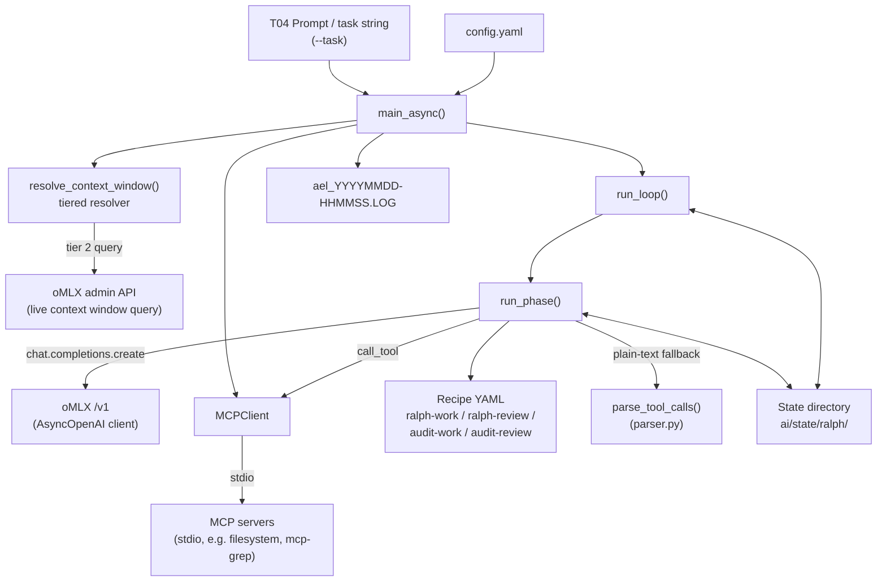
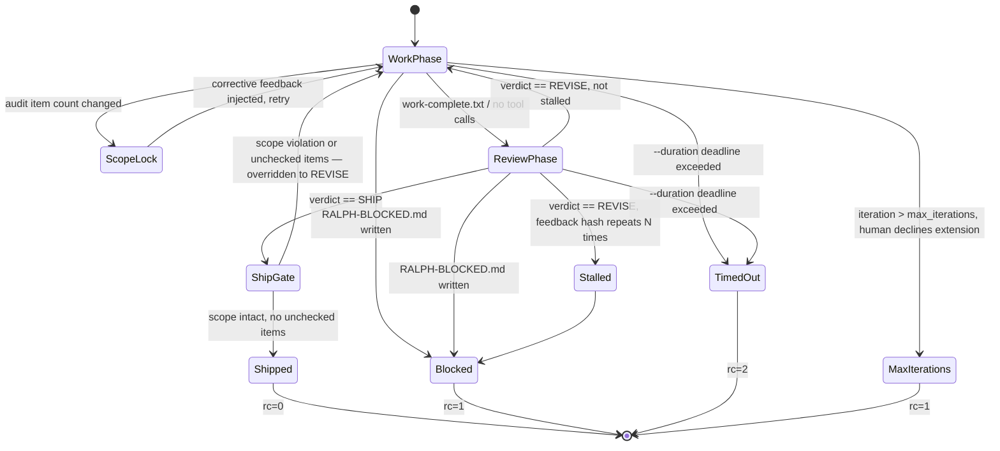

Created: 2026 July 09

# AEL Orchestrator Design

---

## Table of Contents

[1.0 Purpose](<#1.0 purpose>)
[2.0 Scope](<#2.0 scope>)
[3.0 Architecture](<#3.0 architecture>)
[3.1 Component Diagram](<#3.1 component diagram>)
[3.2 Module Structure](<#3.2 module structure>)
[4.0 Data Model](<#4.0 data model>)
[4.1 State Files](<#4.1 state files>)
[4.2 Configuration Schema](<#4.2 configuration schema>)
[5.0 Components](<#5.0 components>)
[5.1 Context Resolution](<#5.1 context resolution>)
[5.2 Task Resolution](<#5.2 task resolution>)
[5.3 Phase Runner](<#5.3 phase runner>)
[5.4 Ralph Loop Controller](<#5.4 ralph loop controller>)
[5.5 MCPClient](<#5.5 mcpclient>)
[5.6 Tool Call Parser](<#5.6 tool call parser>)
[5.7 Validation Guards](<#5.7 validation guards>)
[5.8 Audit Support](<#5.8 audit support>)
[5.9 Entry Point](<#5.9 entry point>)
[6.0 Control Flow](<#6.0 control flow>)
[6.1 Ralph Loop State Diagram](<#6.1 ralph loop state diagram>)
[6.2 Phase Iteration Flow](<#6.2 phase iteration flow>)
[7.0 Context Window Resolution](<#7.0 context window resolution>)
[8.0 Interfaces](<#8.0 interfaces>)
[8.1 Command Line](<#8.1 command line>)
[8.2 config.yaml Schema](<#8.2 config.yaml schema>)
[8.3 State File Contract](<#8.3 state file contract>)
[8.4 MCP Tool Dispatch](<#8.4 mcp tool dispatch>)
[9.0 Boundary Conditions and Error Handling](<#9.0 boundary conditions and error handling>)
[10.0 Non-Functional Compliance](<#10.0 non-functional compliance>)
[11.0 Element Registry](<#11.0 element registry>)
[12.0 Proposed Extensions (Not Implemented)](<#12.0 proposed extensions (not implemented)>)
[13.0 Open Issues](<#13.0 open issues>)
[14.0 Requirements Traceability](<#14.0 requirements traceability>)
[Version History](<#version history>)

---

## 1.0 Purpose

This document specifies the as-built component design of the AEL orchestrator,
reverse-engineered from [ael-requirements.md](../requirements/ael-requirements.md)
v1.1 and `ai/ael/src/orchestrator.py`. The orchestrator is the Tactical Domain's
reference implementation: a single-process Python tool that runs a worker/reviewer
Ralph Loop against an oMLX-served local model until `SHIP` or a boundary condition
is reached.

No prior design document existed for this component; this document is derived
from source, not the reverse. Divergences between requirements and source are
noted explicitly rather than reconciled silently.

[Return to Table of Contents](<#table of contents>)

---

## 2.0 Scope

| Aspect | Decision |
|---|---|
| Deliverable covered | `ai/ael/src/orchestrator.py`, `ai/ael/src/mcp_client.py`, `ai/ael/src/parser.py` |
| Configuration | `ai/ael/config.yaml` |
| Recipes | `ai/ael/recipes/*.yaml` (referenced by name; recipe content out of scope per requirements §Scope) |
| Coverage | As-built only (FR-AEL-001–015, NFR-AEL-001–005). Proposed requirements (FR-AEL-P01–P12) are not present in source — see §12.0 |
| Out of scope | oMLX inference endpoint implementation, MCP server implementations, recipe content |

[Return to Table of Contents](<#table of contents>)

---

## 3.0 Architecture

Pattern: single-process async orchestrator owning an external tool-dispatch loop.
The model is never given native tool execution — the orchestrator parses tool
calls from the completion response (OpenAI structured or Mistral/Cohere
plain-text) and dispatches them itself via `MCPClient`, injecting results back
into the message history. This is a direct architectural response to OI-001/OI-002
(§13.0): Devstral/Cohere-family models on oMLX do not support a native tool loop.

### 3.1 Component Diagram



Legend: solid arrows are control/data flow. `RUNPHASE` and `RUNLOOP` read and
write the state directory as their sole means of communicating with the
Strategic Domain and with each other across process boundaries (state files
persist between `worker`/`reviewer`/`loop` invocations).

### 3.2 Module Structure

```
ai/ael/
├── config.yaml                  # runtime configuration (§4.2)
├── requirements.txt              # openai, mcp, pyyaml, rich
├── recipes/
│   ├── ralph-work.yaml
│   ├── ralph-review.yaml
│   ├── audit-work.yaml
│   └── audit-review.yaml
└── src/
    ├── orchestrator.py           # entry point, loop control, budget, state I/O
    ├── mcp_client.py              # MCPClient — stdio MCP session management
    └── parser.py                  # parse_tool_calls — Mistral/Cohere text parsing
```

No package (`__init__.py` absent); `orchestrator.py` imports `mcp_client` and
`parser` via `sys.path.insert(0, os.path.dirname(__file__))`.

[Return to Table of Contents](<#table of contents>)

---

## 4.0 Data Model

### 4.1 State Files

All paths relative to `state_dir` (`ai/state/ralph/` by default, per `config.yaml`
`loop.state_dir`). Cleared selectively by `reset_state()` — logs and
`context-budget.md` are preserved across reset.

| File | Written by | Read by | Purpose |
|---|---|---|---|
| `task.md` | `main_async` | `main_async` (fallback when `--task` absent) | Resolved task text with runtime-context header |
| `iteration.txt` | `run_loop` | — (human/govwatch reference) | Current outer loop iteration number |
| `work-summary.txt` | `run_phase` (worker only) | `_run_syntax_gate` | Worker's final response text |
| `work-complete.txt` | Tactical Domain, via MCP write during worker phase | `run_phase` (completion signal) | Signals worker phase is done |
| `review-result.txt` | Tactical Domain, via MCP write during review phase | `run_loop` (verdict, precedence source) | Raw `SHIP`/`REVISE` text |
| `review-feedback.txt` | Tactical Domain, via MCP; or `run_loop` fallback extraction | `run_loop` (next iteration task input) | Reviewer notes for next work phase |
| `.ralph-complete` | `run_loop` | Strategic Domain / govwatch | Success marker (SHIP) |
| `.ralph-timeout` | `run_loop` | Strategic Domain / govwatch | Duration-limit exit sentinel |
| `RALPH-BLOCKED.md` | `run_phase`, `run_loop`, `_completion_with_retry` | Strategic Domain (T03 issue seed) | Failure detail; loop exits non-zero |
| `context-budget.md` | `write_context_report` (startup) | Strategic Domain (T04 authoring precondition) | Context window, thresholds, headroom, guidance |
| `audit-index.md` | Strategic Domain (pre-loop, audit runs only) | `run_phase`, `run_loop` (item injection, scope lock) | Checklist of audit items; presence selects audit recipe pair |
| `audit-report.md` | Tactical Domain, via MCP append; initialised zero-byte by `main_async` | `_archive_audit_artifacts` | Accumulated audit findings; append-only guarded (§5.7) |
| `ael_YYYYMMDD-HHMMSS.LOG` | `setup_logging` | Strategic Domain (post-mortem) | Structured DEBUG/INFO/WARNING/ERROR log; final line always `AEL end rc=N` |

Not cleared by reset: `ael_*.LOG` and `context-budget.md`.

### 4.2 Configuration Schema

Derived from `ai/ael/config.yaml`. CLI flags override where noted (§8.1).

| Key | Type | Default (repo config) | Purpose |
|---|---|---|---|
| `omlx.base_url` | str | `http://127.0.0.1:8000/v1` | oMLX OpenAI-compatible endpoint |
| `omlx.api_key` | str | `"local"` | Passed to `AsyncOpenAI` (unused by oMLX) |
| `omlx.default_model` | str | `mistralai_Devstral-Small-2-24B-Instruct-2512-MLX-8Bit` | Base model id (worker default); overridden by `--model` |
| `omlx.worker_model` | str \| null | — (unset) | Optional worker-phase model; resolution `--worker-model` > this > `default_model` |
| `omlx.reviewer_model` | str \| null | `Magistral-Small-2509-MLX-6bit` | Optional reviewer-phase model; resolution `--reviewer-model` > this > `default_model` |
| `mcp_servers.<name>.command` / `.args` / `.env` | dict | — | Per-server stdio launch spec; `{PROJECT_ROOT}` placeholder substituted at runtime |
| `readiness.timeout_seconds` | float | 60 | `await_model_ready` deadline |
| `readiness.poll_interval_seconds` | float | 2 | `await_model_ready` poll interval |
| `loop.max_iterations` | int | 5 | Outer Ralph Loop cycles; overridden by `--max-iterations` |
| `loop.phase_max_iterations` | int | 20 | Inner tool-call iterations per phase |
| `loop.mcp_error_threshold` | int | 3 | Consecutive MCP errors before BLOCKED |
| `loop.max_tool_calls_per_iteration` | int | 10 | Per-iteration tool call truncation cap |
| `loop.preflight_check` | bool | false | Enable `run_preflight_check` before first worker iteration |
| `loop.phase_duration_minutes` | float \| null | 30 | Soft wall-clock cap per phase (F28) |
| `loop.state_dir` | str | `ai/state/ralph` | State directory, resolved to absolute path |
| `execution.max_completion_tokens` | int \| null | null | Opt-in output cap; passed as `max_tokens` when set (b5e9d240) |
| `execution.max_tool_result_chars` | int \| null | null | Opt-in head/tail truncation of tool results when set (b5e9d240) |
| `execution.strict_tactical_brief` | bool | false | When true + `ael` profile, fail fast on a missing brief instead of raw-document fallback (b5e9d240) |
| `context.context_window` | int \| null | null | Tier 1 explicit override (§7.0) |
| `context.budget_warn_pct` | float | 0.80 | Warn threshold fraction |
| `context.budget_abort_pct` | float | 0.95 | Abort threshold fraction |
| `context.model_context_windows.<model>` | int | — | Tier 3 per-model override |

[Return to Table of Contents](<#table of contents>)

---

## 5.0 Components

### 5.1 Context Resolution

Responsibility: resolve the model's context window, estimate token usage, and
enforce/report budget thresholds.

- `resolve_context_window()` — four-tier chain (§7.0).
- `_query_omlx_context_window()` — tier 2 live query against the oMLX admin API;
  never raises, returns `None` on any failure (logged at WARNING).
- `estimate_tokens()` — `len(content) // 4` heuristic over message content plus
  serialized tool-schema JSON; intentionally biased toward overestimation.
- `check_context_budget()` — pure function returning `(status, fraction)` where
  status ∈ `{ok, warn, abort}`.
- `write_context_report()` — writes `context-budget.md`; includes per-iteration
  accumulation estimate (~300 tokens) and iterations-to-threshold projections.
- `_ctx_bar()` — renders the inline terminal progress bar (rich markup).

### 5.2 Task Resolution

Responsibility: derive the task string passed into the loop.

- `main_async` resolves task precedence: `--task <file>` → `extract_tactical_brief()`
  (fallback to raw document) → `--task <string>` → `state_dir/task.md`.
- `extract_tactical_brief()` — two-pass extraction (Pass 1: `tactical_brief` root
  key in a fenced ` ```yaml ` block; Pass 2: fenced block beneath a
  `## N.N Tactical Brief` heading, WARNING-logged fallback). Empty result on both
  passes falls back to the raw document text (FR-AEL-007).
- `run_preflight_check()` — optional (`loop.preflight_check`), two-pass
  `success_criteria` extraction with deterministic grep/`py_compile` checks;
  prepends a `[PRE-FLIGHT]` summary block to the task.

### 5.3 Phase Runner

`run_phase()` — single worker or reviewer pass: injects tool schema, sends
completions, dispatches tool calls, loops until no tool calls remain or a
boundary condition fires. Key behaviours:

- Read-only tool subset (`mcp.get_openai_tools(readonly=True)`) for reviewer
  phases; full toolset for worker phases.
- Reasoning extraction from `reasoning_content`, `<think>` tags, or Cohere
  `<|START_THINKING|>` blocks; untagged pre-tool-call narration surfaced separately.
- Per-iteration context budget check; `abort` status returns failure before the
  completion call is made.
- Tool call cap applied before assistant-message construction (avoids orphaned
  tool_call IDs).
- Duplicate-read tracking (per-path counter, WARNING on repeat) and
  repeated-identical-failed-call tracking (per `(tool, arguments)` signature;
  corrective hint at 2 occurrences, BLOCKED at 4).
- Post-write `py_compile` check on `.py` targets; syntax errors injected as
  corrective guidance in the tool result.
- Phase wall-clock cap (`phase_duration_minutes`): returns success with an
  empty summary rather than failing, so a stuck item is retried under a fresh
  cap on the next loop iteration rather than aborting the run.
- Audit runs: next unchecked `audit-index.md` item is prepended to the worker
  task each iteration.
- Opt-in execution controls (§4.2, default off): `execution.max_completion_tokens`
  caps output; `execution.max_tool_result_chars` head/tail-truncates large tool
  results before append; `execution.strict_tactical_brief` fails fast on a missing
  `ael` brief.

### 5.4 Ralph Loop Controller

`run_loop()` — full worker/reviewer cycle:

1. Clear transient state; snapshot `audit-index.md` item count if present.
2. Optional pre-flight check.
3. Per outer iteration: work phase → audit scope lock check → review phase.
4. Verdict resolution: `review-result.txt` takes precedence over the reviewer's
   final message (both normalized via `_normalize_verdict()`, which matches
   only an exact leading `SHIP` token).
5. On `SHIP`: audit scope-lock and unchecked-item gates can override to
   `REVISE` before acceptance (audit runs only).
6. On `REVISE`: stall detection via SHA-256 hash of feedback content — N
   (`stall_threshold`, default 3) consecutive identical hashes → BLOCKED.
7. Boundary exits: max iterations (with interactive human extension prompt),
   `--duration` deadline (`.ralph-timeout`, return code 2), `RALPH-BLOCKED.md`
   presence (return code 1), `.ralph-complete` (return code 0).

### 5.5 MCPClient

`mcp_client.py` — async stdio session manager, one `ClientSession` per configured
server, aggregated into a single flat tool catalogue (tool names assumed unique
across servers). `connect()`/`close()` share an `AsyncExitStack` and must run in
the same asyncio task. `get_openai_tools(readonly=False)` filters by regex
against `_READONLY_TOOL_PATTERNS` (`read`, `list`, `grep`, `search`, `stat`,
`get_file_info`, `find`, `head`, `tail`, `cat` prefixes). `call_tool()` never
raises — exceptions are caught and returned as `"Error calling '<name>': <e>"`
strings, which `_is_mcp_error()` (§5.7) detects by prefix.

### 5.6 Tool Call Parser

`parser.py` — `parse_tool_calls()` handles three formats, tried in order, first
non-empty result wins:

1. Mistral JSON (`[TOOL_CALLS] [...]` or bare object) — bracket-balanced
   `json.JSONDecoder.raw_decode`, supports multiple parallel `[TOOL_CALLS]` blocks.
2. Mistral plain-text (`[TOOL_CALLS]name[ARGS]{...}`) — `_sanitize_json_string()`
   escapes bare newlines inside JSON string literals before a fallback decode.
3. Cohere action-block (`<|START_ACTION|>[...]<|END_ACTION|>`) — `tool_name`/
   `parameters` key convention.

Deduplicates by `(name, sorted-json-arguments)` signature within a single call.

### 5.7 Validation Guards

- `_validate_write_scope()` — rejects write-tool calls whose resolved path falls
  outside `project_root`.
- `_validate_audit_report_write()` — rejects overwrite-semantics writes
  (`write`/`write_file`/`create_file`) to `audit-report.md` that would discard
  existing content not present in the new content; `edit`/`edit_file` unaffected.
- `_is_mcp_error()` — prefix match only (`Error:`, `Error calling`, `MCP error`)
  to avoid misclassifying benign result text.
- `_normalize_verdict()` — exact leading-token match against `SHIP`; anything
  else (including empty) normalizes to `REVISE`.

### 5.8 Audit Support

- `_parse_audit_items()` — shared parser for `- [ ]` / `- [x]` checklist lines.
- `_snapshot_audit_index()` / `_check_audit_scope()` — item-count integrity lock;
  a changed count (add or remove) is reported as a scope violation and injected
  as corrective feedback rather than allowed to pass silently.
- `_count_unchecked_audit_items()` — SHIP gate: reviewer `SHIP` is overridden to
  `REVISE` while unchecked items remain.
- `_run_syntax_gate()` — extracts `.py` paths referenced in `work-summary.txt`,
  runs `py_compile` on each, injects a `[SYNTAX GATE: PASS/FAIL]` block into the
  reviewer task.
- `_archive_audit_artifacts()` — on loop `SHIP` for an audit run, copies
  `audit-index.md`/`audit-report.md` from `state_dir` to
  `ai/workspace/audit/audit-<uuid>-index.md` / `audit-<uuid>-report.md`; UUID
  parsed from the task file basename, date-fallback if absent.

### 5.9 Entry Point

`main()` → `asyncio.run(main_async(args))` → `os._exit(rc)` (bypasses asyncio
teardown to avoid MCP stdio subprocess hang). `main_async()`:

1. Loads `config.yaml`; `reset` mode short-circuits before any model/MCP setup.
2. Selects recipe pair by presence of `audit-index.md` in `state_dir` (single
   detection point shared with the audit-scope/SHIP-gate/archive logic).
3. `await_model_ready()` — polls `/v1/models`; proceeds if the endpoint is
   reachable even when the model is not yet listed (oMLX lazy-loads).
4. `resolve_context_window()`, `MCPClient.connect()`, task resolution, writes
   `task.md` and `context-budget.md`.
5. Dispatches to `run_phase` (`worker`/`reviewer` modes) or `run_loop` (`loop`
   mode, default); on loop `SHIP`, calls `_archive_audit_artifacts()`.
6. `finally`: logs `AEL end rc=N` unconditionally, closes MCP connections.

`setup_logging()` — one `FileHandler` per process onto `ael_<timestamp>.LOG`;
`logger.propagate = False` prevents duplicate console output via the root logger.

[Return to Table of Contents](<#table of contents>)

---

## 6.0 Control Flow

### 6.1 Ralph Loop State Diagram



### 6.2 Phase Iteration Flow

Within a single `run_phase()` call, each of up to `phase_max_iterations` inner
iterations: context budget
check → completion call (bounded retry, §9.0) → parse tool calls (OpenAI
structured, else Mistral/Cohere text) → truncate to `max_tool_calls_per_iteration`
→ dispatch each call through the validation guards (§5.7) → append results →
check `work-complete.txt`. No tool calls in the response ends the phase.

[Return to Table of Contents](<#table of contents>)

---

## 7.0 Context Window Resolution

`resolve_context_window()` implements a four-tier chain (FR-AEL-005, FR-AEL-008):

| Tier | Source | Condition |
|---|---|---|
| 1 | `config.context.context_window` | Non-null explicit global override |
| 2 | Live oMLX admin API query (`settings.max_context_window`) | `omlx.base_url` configured; query succeeds and returns non-null |
| 3 | `config.context.model_context_windows.<model_name>` | Entry present for the active model |
| 4 | Unresolved | Returns `None`; budget tracking disabled, `context-budget.md` states the window could not be determined |

This supersedes the retired standalone `budget.py` file-existence gate
(governance change-d42e64a9): the resolver is fully contained in
`orchestrator.py`, and `context-budget.md` is written automatically at every
AEL startup rather than by a separate script.

[Return to Table of Contents](<#table of contents>)

---

## 8.0 Interfaces

### 8.1 Command Line

| Argument | Default | Purpose |
|---|---|---|
| `--config` | `<script_dir>/../config.yaml` | Path to configuration file |
| `--mode` | `loop` | `worker` \| `reviewer` \| `loop` \| `reset` |
| `--task` | — | Task string, or path to a task file |
| `--model` | `omlx.default_model` | Model for all phases |
| `--worker-model` | `omlx.worker_model`, else `--model`/`default_model` | Loop mode: worker-phase model override |
| `--reviewer-model` | `omlx.reviewer_model`, else `--model`/`default_model` | Loop mode: reviewer-phase model override |
| `--max-iterations` | `loop.max_iterations` | Outer iteration limit override |
| `--duration` | none (no limit) | Wall-clock time limit in hours |

Invocation (governance §1.1.8, primer §4.0):

```bash
python ai/ael/src/orchestrator.py --mode loop \
  --task ai/workspace/prompt/prompt-<uuid>-<n>.md
```

### 8.2 config.yaml Schema

See §4.2.

### 8.3 State File Contract

See §4.1. This is the sole communication channel between orchestrator
processes and between the orchestrator and the Strategic Domain — there is no
IPC or shared-memory mechanism.

### 8.4 MCP Tool Dispatch

The orchestrator does not use oMLX's native MCP tool-execution facility
(non-functional per OI-002); `/v1/mcp/execute` is not called. `MCPClient`
performs dispatch directly: tool schemas are injected into the completion
request's `tools` parameter, the model's response is parsed for tool calls by
whichever mechanism matches (§5.6), and `MCPClient.call_tool()` executes them
against the owning stdio server session.

[Return to Table of Contents](<#table of contents>)

---

## 9.0 Boundary Conditions and Error Handling

| Condition | Handling |
|---|---|
| Context budget `abort` | `run_phase` returns failure before the completion call |
| Completion call failure | `_completion_with_retry`: 3 attempts, exponential backoff (2.0s ×2.0); persistent failure writes `RALPH-BLOCKED.md` and raises `RuntimeError` (caught, not propagated) |
| MCP tool error | Corrective message injected into tool result; `mcp_error_threshold` (default 3) consecutive errors → `RALPH-BLOCKED.md` |
| Repeated identical failed call | Corrective hint at 2nd occurrence of the same `(tool, arguments)` signature; `RALPH-BLOCKED.md` at 4th |
| Edit pattern not found | Targeted corrective message instructs a re-read before retry; `.py` targets additionally get a `py_compile` check appended |
| Tool call count exceeds cap | Truncated to `max_tool_calls_per_iteration` before assistant-message construction |
| Unparsed `[TOOL_CALLS]` marker in final response | `RALPH-BLOCKED.md` — treated as a malformed response, not a benign summary |
| Duplicate file read (same path, same phase) | Logged at WARNING; not blocking |
| Audit scope violation (item count changed) | Corrective feedback injected; loop iteration retried, not blocked immediately |
| Reviewer stall (N identical feedback hashes) | `RALPH-BLOCKED.md` after `stall_threshold` (default 3) |
| Phase wall-clock cap exceeded | Phase returns success with empty summary; item retried next outer iteration under a fresh cap |
| `--duration` deadline exceeded | Loop exits with `.ralph-timeout` and return code 2 (distinct from BLOCKED's 1) |
| Max iterations reached | Interactive human prompt to extend; declining exits return code 1 |
| Model endpoint unreachable at startup | `await_model_ready` raises `TimeoutError` after `readiness.timeout_seconds` |
| Unexpected exception in `main_async` | `rc` pre-initialised to 1; `finally` block always logs `AEL end rc=N` before exit, so an unclean termination is distinguishable from a clean one by log inspection |

[Return to Table of Contents](<#table of contents>)

---

## 10.0 Non-Functional Compliance

| NFR | Design provision |
|---|---|
| NFR-AEL-001 Single process | No subprocess spawning beyond MCP server stdio processes (`py_compile` invocations are the sole additional `subprocess.run` use, not daemonized) |
| NFR-AEL-002 Async execution | `asyncio` throughout for completion calls and MCP dispatch; `run_phase`/`run_loop`/`main_async` are all coroutines |
| NFR-AEL-003 Config-driven | All runtime parameters read from `config.yaml` (§4.2); `--model`, `--max-iterations`, `--config` are the only CLI overrides |
| NFR-AEL-004 Backward compatibility | `--task <file or string>` interface unchanged; `extract_tactical_brief` fallback to raw document preserves behaviour for documents lacking a `tactical_brief` block |
| NFR-AEL-005 Minimal dependencies | `requirements.txt`: `openai`, `mcp`, `pyyaml`, `rich` only — no platform-specific or optional dependencies |

[Return to Table of Contents](<#table of contents>)

---

## 11.0 Element Registry

snake_case functions, PascalCase classes, UPPER_SNAKE constants. Leading
underscore denotes module-private.

**Context / budget**

| Element | Signature |
|---|---|
| `resolve_context_window` | `(model_name: str, config: dict) -> int \| None` |
| `_query_omlx_context_window` | `(model_name: str, base_url: str) -> int \| None` |
| `estimate_tokens` | `(messages: list[dict], tools: list[dict] \| None = None) -> int` |
| `check_context_budget` | `(estimated: int, context_window: int, warn_pct: float, abort_pct: float) -> tuple[str, float]` |
| `write_context_report` | `(state_dir: str, model: str, context_window: int \| None, initial_tokens: int, warn_pct: float, abort_pct: float) -> None` |
| `_ctx_bar` | `(estimated: int, context_window: int, status: str) -> str` |

**State I/O**

| Element | Signature |
|---|---|
| `read_state` | `(state_dir: str, filename: str) -> str` |
| `write_state` | `(state_dir: str, filename: str, content: str) -> None` |
| `clear_state` | `(state_dir: str, *filenames: str) -> None` |
| `reset_state` | `(state_dir: str) -> int` |
| `_RESET_FILES` | `list[str]` — files cleared by `reset_state` |
| `load_yaml` | `(path: str) -> dict` |
| `_substitute_project_root` | `(config: dict) -> dict` |

**Phase execution**

| Element | Signature |
|---|---|
| `run_phase` | `async (client, mcp, model, recipe, task, max_iterations, state_dir, log, phase_label="", context_window=None, budget_warn_pct=0.80, budget_abort_pct=0.95, mcp_error_threshold=3, max_tool_calls_per_iter=10, project_root="", phase_duration_seconds=None) -> tuple[int, str]` |
| `extract_reasoning` | `(message, content: str, log) -> tuple[str, str]` |
| `format_tool_signatures` | `(tools: list[dict]) -> str` |
| `_completion_with_retry` | `async (client, model, messages, tools, log, state_dir, max_retries=3, initial_backoff=2.0, backoff_multiplier=2.0) -> response` |
| `run_preflight_check` | `(task: str, log) -> str` |
| `_run_syntax_gate` | `(state_dir: str, log) -> str` |
| `extract_tactical_brief` | `(raw: str, log) -> str` |

**Loop control**

| Element | Signature |
|---|---|
| `run_loop` | `async (client, mcp, worker_model, reviewer_model, work_recipe, review_recipe, task, max_iterations, phase_max_iterations, state_dir, log, context_window=None, budget_warn_pct=0.80, budget_abort_pct=0.95, mcp_error_threshold=3, max_tool_calls_per_iter=10, preflight_check=False, deadline=None, project_root="", stall_threshold=3, phase_duration_seconds=None) -> int` |
| `_normalize_verdict` | `(text: str) -> str` |
| `_hash_feedback` | `(feedback: str) -> str` |
| `_DEFAULT_STALL_THRESHOLD` | `int = 3` |

**Audit support**

| Element | Signature |
|---|---|
| `_parse_audit_items` | `(index_path: str) -> list[tuple[bool, str]]` |
| `_snapshot_audit_index` | `(state_dir: str, log) -> int \| None` |
| `_check_audit_scope` | `(state_dir: str, original_count: int \| None, log) -> str \| None` |
| `_count_unchecked_audit_items` | `(state_dir: str, log) -> int` |
| `_archive_audit_artifacts` | `(state_dir: str, task_path: str \| None, log) -> None` |

**Validation guards**

| Element | Signature |
|---|---|
| `_validate_write_scope` | `(tool_name: str, arguments: dict, project_root: str) -> str \| None` |
| `_validate_audit_report_write` | `(tool_name: str, arguments: dict, state_dir: str) -> str \| None` |
| `_is_mcp_error` | `(result: str) -> bool` |
| `_WRITE_TOOLS` | `set[str]` |
| `_MCP_ERROR_PREFIXES` | `tuple[str]` |
| `_EDIT_PATTERN_ERRORS` | `tuple[str]` |

**Entry point**

| Element | Signature |
|---|---|
| `main_async` | `async (args: argparse.Namespace) -> int` |
| `main` | `() -> None` |
| `setup_logging` | `(state_dir: str) -> logging.Logger` |
| `await_model_ready` | `async (client, model, timeout=60.0, interval=2.0) -> None` |
| `PROJECT_ROOT` | `str = os.getcwd()` at import time |
| `console` | `rich.console.Console` |

**mcp_client.py**

| Element | Signature |
|---|---|
| `MCPClient` | class — `__init__(servers: dict[str, dict])` |
| `MCPClient.connect` | `async () -> None` |
| `MCPClient.get_openai_tools` | `(readonly: bool = False) -> list[dict]` |
| `MCPClient.call_tool` | `async (name: str, arguments: dict) -> str` |
| `MCPClient.close` | `async () -> None` |
| `MCPClient._is_readonly_tool` | `(name: str) -> bool` |
| `_READONLY_TOOL_PATTERNS` | `tuple[str]` — regex prefixes |

**parser.py**

| Element | Signature |
|---|---|
| `parse_tool_calls` | `(content: str) -> list[dict[str, Any]]` |
| `_sanitize_json_string` | `(s: str) -> str` |

[Return to Table of Contents](<#table of contents>)

---

## 12.0 Proposed Extensions (Not Implemented)

The following requirements groups from `ael-requirements.md` §Proposed
Requirements have no corresponding source in `orchestrator.py` as of this
document's creation. They are recorded here for traceability only — no design
decisions are made ahead of implementation.

| Group | Requirements | Status |
|---|---|---|
| Strategic Domain Task Authoring | FR-AEL-P01–P04 | `extract_tactical_brief()` still present and active (§5.2); task-file-as-primary-input not implemented |
| Pipeline Mode | FR-AEL-P05–P12 | No `--mode pipeline`, no `pipeline.tasks_dir` config key, no task-queue discovery or per-task state isolation in source |

[Return to Table of Contents](<#table of contents>)

---

## 13.0 Open Issues

Carried from `ael-requirements.md` §Open Issues, annotated against current design.

| ID | Description | Design note |
|---|---|---|
| OI-001 | Mistral plain-text tool call format incompatible with standard OpenAI tool loop | Resolved architecturally: orchestrator owns the dispatch loop externally (§3.0, §5.6); no change proposed |
| OI-002 | oMLX MCP native tool execution non-functional (GitHub issue #71) | Consistent with design: `MCPClient` never relies on `/v1/mcp/execute` (§8.4); no orchestrator-side action pending upstream fix |
| OI-003 | Pipeline task dependency ordering not formally specified | Applies to §12.0 (not yet designed); remains open |
| OI-004 | Pipeline mode behaviour on empty/no `.md` tasks directory undefined | Applies to §12.0 (not yet designed); remains open |

[Return to Table of Contents](<#table of contents>)

---

## 14.0 Requirements Traceability

| Requirement | Design section |
|---|---|
| FR-AEL-001 Ralph Loop | §5.4, §6.1 |
| FR-AEL-002 Execution modes | §5.9, §8.1 |
| FR-AEL-003 MCP tool dispatch | §5.5, §8.4 |
| FR-AEL-004 Mistral tool call parsing | §5.6 |
| FR-AEL-005 Context budget enforcement | §5.1, §7.0 |
| FR-AEL-006 State directory management | §4.1 |
| FR-AEL-007 Task extraction from T04 document | §5.2 (superseded by §12.0 if implemented) |
| FR-AEL-008 Context window resolution | §7.0 |
| FR-AEL-009 Model readiness polling | §5.9 |
| FR-AEL-010 SHIP/BLOCKED outcome signalling | §4.1, §6.1 |
| FR-AEL-011 Structured log output | §5.9 |
| FR-AEL-012 Context budget report | §5.1 |
| FR-AEL-013 MCP error handling | §5.7, §9.0 |
| FR-AEL-014 Tool call cap | §5.3, §9.0 |
| FR-AEL-015 Duplicate read detection | §5.3, §9.0 |
| NFR-AEL-001..005 | §10.0 |

[Return to Table of Contents](<#table of contents>)

---

## Version History

| Version | Date | Description |
|---|---|---|
| 0.1 | 2026-07-09 | Initial design document reverse-engineered from ael-requirements.md v1.1 and ai/ael/src/orchestrator.py (plus mcp_client.py, parser.py); no prior design existed for this component |
| 0.2 | 2026-07-16 | Updated for c3a7f0d2 (removed §6.2 per-iteration system-prompt countdown), b5e9d240 (added execution.* opt-in controls to §4.2 and §5.3), a7d3f8b1 (default_model → Devstral 8bit; added omlx.worker_model/reviewer_model to §4.2 and §8.1). §11.0 element-registry signatures pending re-sync from source |

---

Copyright (c) 2026 William Watson. MIT License.
