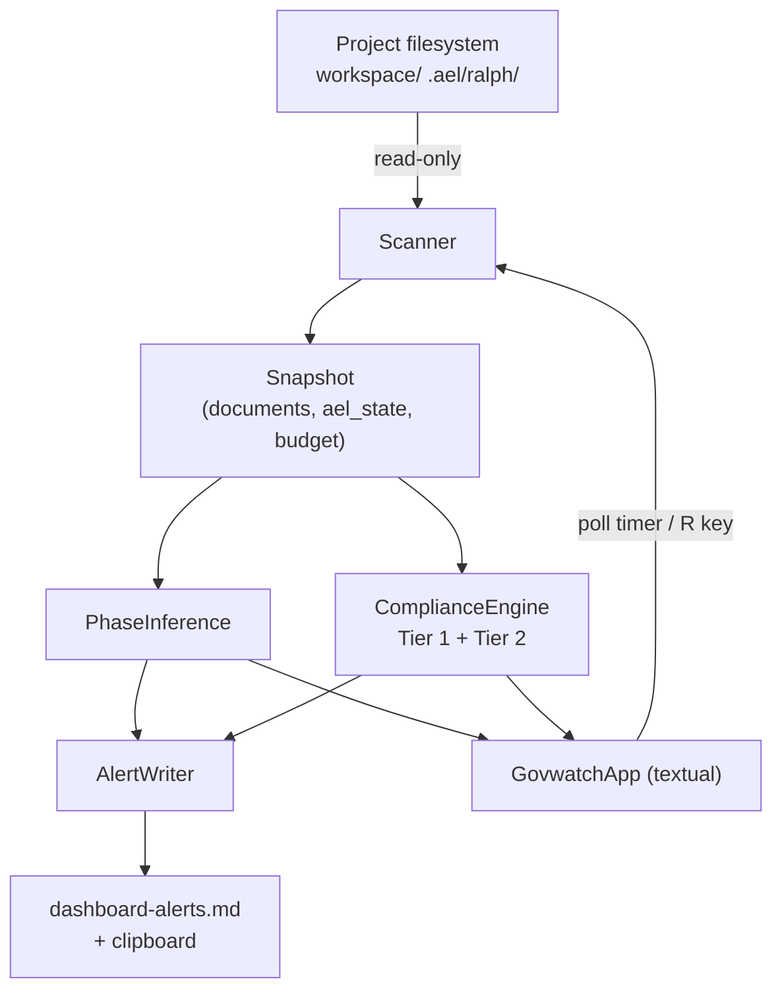
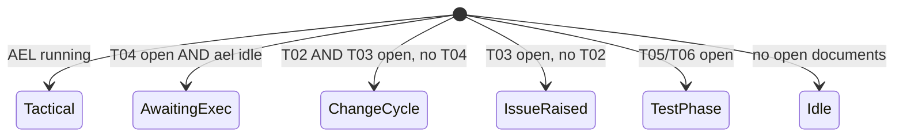

Created: 2026 June 10

# govwatch Design

---

## Table of Contents

[1.0 Purpose](<#1.0 purpose>)
[2.0 Scope](<#2.0 scope>)
[3.0 Architecture](<#3.0 architecture>)
[3.1 Component Diagram](<#3.1 component diagram>)
[3.2 Module Structure](<#3.2 module structure>)
[4.0 Data Model](<#4.0 data model>)
[5.0 Components](<#5.0 components>)
[5.1 Scanner](<#5.1 scanner>)
[5.2 PhaseInference](<#5.2 phaseinference>)
[5.3 ComplianceEngine](<#5.3 complianceengine>)
[5.4 AlertWriter](<#5.4 alertwriter>)
[5.5 GovwatchApp](<#5.5 govwatchapp>)
[6.0 Phase Inference Logic](<#6.0 phase inference logic>)
[7.0 Compliance Checks](<#7.0 compliance checks>)
[8.0 Interfaces](<#8.0 interfaces>)
[8.1 Command Line](<#8.1 command line>)
[8.2 Key Bindings](<#8.2 key bindings>)
[8.3 dashboard-alerts.md Format](<#8.3 dashboard-alerts.md format>)
[8.4 Clipboard Payload](<#8.4 clipboard payload>)
[9.0 Document Parsing](<#9.0 document parsing>)
[10.0 Error Handling](<#10.0 error handling>)
[11.0 Non-Functional Compliance](<#11.0 non-functional compliance>)
[12.0 Element Registry](<#12.0 element registry>)
[13.0 Resolved Open Questions](<#13.0 resolved open questions>)
[14.0 Propagation](<#14.0 propagation>)
[15.0 Requirements Traceability](<#15.0 requirements traceability>)
[Version History](<#version history>)

---

## 1.0 Purpose

This document specifies the component design for `govwatch`, derived from
[requirements-govwatch.md](../requirements/requirements-govwatch.md) v0.3. `govwatch`
is a standalone read-only governance monitoring TUI for downstream projects. It
infers workflow phase, runs a two-tier compliance scan, lists open documents, and
emits an alert summary to the clipboard and to `dashboard-alerts.md`.

The tool is a single-tier component: one Python module, no AEL runtime dependency.
A three-tier design hierarchy is not warranted.

[Return to Table of Contents](<#table of contents>)

---

## 2.0 Scope

| Aspect | Decision |
|---|---|
| Deliverable | `framework/ai/src/govwatch.py` (single module) |
| Dependency manifest | `framework/ai/src/requirements-govwatch.txt` |
| Runtime location (downstream) | `ai/src/govwatch.py`, run from project root |
| Libraries | `textual`, `rich` only |
| Write targets | `dashboard-alerts.md` (project root) only |
| Python | 3.11+ |

Out of scope items are inherited from requirements §7.0 and not restated here.

[Return to Table of Contents](<#table of contents>)

---

## 3.0 Architecture

Pattern: passive polling observer with a `textual` presentation layer. A timer
triggers a scan at a fixed interval; the scan produces an immutable snapshot;
the snapshot updates the panels and is written to the alert sink. No component
writes to monitored directories.

Data flow: `filesystem → Scanner → snapshot → {PhaseInference, ComplianceEngine}
→ panels + AlertWriter → dashboard-alerts.md / clipboard`.

### 3.1 Component Diagram



Legend: solid arrows are data flow; the timer/R-key edge re-triggers a scan.
All filesystem access is read-only except the `AlertWriter → dashboard-alerts.md`
edge (CON-07).

### 3.2 Module Structure

Single file, internal separation by class. No package; no `__init__.py`.

```
ai/src/
├── govwatch.py                 # all classes + main()
└── requirements-govwatch.txt   # textual, rich
```

[Return to Table of Contents](<#table of contents>)

---

## 4.0 Data Model

Immutable dataclasses form the scan snapshot. Each scan replaces the snapshot
wholesale; no mutation across cycles.

| Type | Fields |
|---|---|
| `ProjectPaths` | `root`, `workspace`, `ael_state` (`.ael/ralph/`), `alerts_file` |
| `DocumentRecord` | `cls`, `uuid`, `name`, `path`, `iteration`, `coupled_ref`, `coupled_iteration`, `is_master`, `parse_ok` |
| `AelState` | `status` (`idle`/`running`/`ship`/`blocked`), `iteration`, `blocked_detail` |
| `BudgetState` | `present`, `status` (`ok`/`warn`/`abort`/`unknown`), `initial_pct` |
| `Alert` | `severity` (`violation`/`warning`/`ok`), `code`, `message`, `document` |
| `Snapshot` | `documents`, `ael_state`, `budget`, `phase`, `alerts`, `scan_time` |

`cls` ∈ {issue, change, prompt, test, result, audit, trace, requirements, design}.
`coupled_ref` holds the partner UUID parsed from the document body where present.

[Return to Table of Contents](<#table of contents>)

---

## 5.0 Components

### 5.1 Scanner

Responsibility: produce a `Snapshot` from the filesystem.

- Resolve `ProjectPaths` from the invocation root (or `--project`).
- Enumerate open documents under `workspace/<dir>/`, excluding `closed/`
  subtrees. Class-to-directory mapping is explicit (see §9.0); note `issue → issues/`.
- For each document: parse filename, then parse body fields (§9.0). Parse failure
  sets `parse_ok=False` and yields a WARNING alert rather than raising (NFR-04).
- Read `.ael/ralph/` state files to build `AelState`. Absent directory → `idle`
  (NFR-05).
- Read `context-budget.md` to build `BudgetState` (§7.0, FR-01-05).
- Filesystem reads only; no subprocess spawned during scan (NFR-03).

### 5.2 PhaseInference

Responsibility: derive a single workflow phase from the snapshot using the
precedence in §6.0. Pure function of `documents` + `ael_state`.

### 5.3 ComplianceEngine

Responsibility: produce the `Alert` list. Two tiers (§7.0). Tier 1 (filename /
structure) runs first and unconditionally. Tier 2 (content) runs over documents
with `parse_ok=True`. A document failing Tier 1 naming is still reported; Tier 2
degrades to a WARNING on parse error and continues (requirements §9.3).

### 5.4 AlertWriter

Responsibility: render the alert summary once per scan to two sinks.

- Build the plain-text payload (§8.3 / §8.4).
- Overwrite `dashboard-alerts.md` — never append (FR-04-04). This is the sole
  write. Write failure produces an in-TUI WARNING; it does not crash the app.
- On `C` key: copy the payload to the clipboard. Clipboard transport uses
  `textual`'s built-in copy facility to avoid an external dependency (CON-04).

### 5.5 GovwatchApp

Responsibility: `textual.App` subclass owning layout, polling timer, and bindings.

- Three panels: Workflow State, Compliance Alerts, Document Registry (layout per
  requirements §9.2).
- `set_interval(interval, self.refresh_scan)` drives polling (FR-01-06).
- Startup runs `validate_project()`; on failure, print a clear message and exit
  non-zero before entering the TUI (FR-05-04).

[Return to Table of Contents](<#table of contents>)

---

## 6.0 Phase Inference Logic

Precedence is evaluated top-down; the first match wins (FR-01-02).



| Order | Condition | Phase |
|---|---|---|
| 1 | `ael_state.status == running` | Tactical execution |
| 2 | open prompt (T04) present, AEL idle | Awaiting prompt execution |
| 3 | open change (T02) and issue (T03) present, no open prompt | Change cycle |
| 4 | open issue (T03) present, no open change | Issue raised |
| 5 | open test (T05) or result (T06) present | Test phase |
| 6 | no open documents | Idle |

Conditions 2–6 evaluate over open documents only (excluding `closed/`).

[Return to Table of Contents](<#table of contents>)

---

## 7.0 Compliance Checks

### 7.1 Tier 1 — Filename and Structure

| FR | Check | Severity |
|---|---|---|
| FR-02-01 | T02 with no T03 sharing its UUID | VIOLATION |
| FR-02-02 | T03 with no coupled T02 sharing its UUID | WARNING |
| FR-02-03 | T04 with no coupled T02 sharing its UUID | VIOLATION |
| FR-02-04 | filename not matching `<class>-<8hex>-<name>.md` (masters exempt) | WARNING |
| FR-02-05 | open document present while AEL signals SHIP | WARNING |
| FR-02-06 | `.ael/ralph/task.md` content not corresponding to any open T04 | WARNING |
| FR-02-07 | `context-budget.md` absent while a T04 is open | WARNING |

Coupling is computed by grouping open documents by UUID and inspecting which
classes are present in each group.

### 7.2 Tier 2 — Document Content

| FR | Check | Severity |
|---|---|---|
| FR-02-08 | coupled T02/T03 iteration numbers differ | VIOLATION |
| FR-02-09 | body `id:` UUID differs from filename UUID | VIOLATION |
| FR-02-10 | T04 `tactical_brief` absent / placeholder (`#`) / not in a ```yaml block | VIOLATION |
| FR-02-11 | T03 required fields empty or placeholder | WARNING |
| FR-02-12 | T02 required fields empty or placeholder | WARNING |

FR-02-10 mirrors the orchestrator: positive only when Pass 1 (`tactical_brief`
root key in a ```yaml block) yields a non-empty value not beginning with `#`
(see §9.2). Required-field sets for FR-02-11/12 are taken from the T02/T03 schema
`required` lists (§9.3).

### 7.3 Budget Status (FR-01-05)

`context-budget.md` carries no live status token. `BudgetState.status` is derived
within the file: parse the initial-load percentage and the warn/abort threshold
percentages, then classify `abort` if initial ≥ abort threshold, `warn` if
initial ≥ warn threshold, else `ok`. Absent file → `unknown`.

### 7.4 Alert Display (FR-02-13..15)

Colour by severity: VIOLATION red, WARNING yellow, OK green. The panel footer
shows last-scan timestamp and total VIOLATION / WARNING counts.

[Return to Table of Contents](<#table of contents>)

---

## 8.0 Interfaces

### 8.1 Command Line

| Argument | Default | Purpose |
|---|---|---|
| `--project PATH` | cwd | project root override (FR-05-02) |
| `--interval N` | 5 | polling seconds (FR-05-03) |

Invocation: `python ai/src/govwatch.py` from project root (FR-05-01).

### 8.2 Key Bindings

| Key | Action |
|---|---|
| `C` | copy alert summary to clipboard (FR-04-01) |
| `R` | force immediate refresh (FR-05-05) |
| `Q` | quit (FR-05-05) |

### 8.3 dashboard-alerts.md Format

Overwritten each scan (FR-04-03/04). Plain markdown, human- and Claude-readable:

```
# govwatch alerts — <project name>

Scan: <ISO timestamp>
Phase: <plain-language phase>
AEL: <status> [iteration N]
Budget: <ok|warn|abort|unknown>

## Violations (<count>)
- [<code>] <message> (<document>)

## Warnings (<count>)
- [<code>] <message> (<document>)
```

When a section has no entries, it states `none`.

### 8.4 Clipboard Payload

Identical content to §8.3 (FR-04-02), so a paste into Claude Desktop carries
project name, timestamp, violations, warnings, and the inferred phase.

[Return to Table of Contents](<#table of contents>)

---

## 9.0 Document Parsing

### 9.1 Filename

Non-master: `^(issue|change|prompt|test|result|audit|trace|requirements|design)-([0-9a-f]{8})-(.+)\.md$`.
Master: `<class>-<name>-master.md` — has no UUID and is exempt from coupling and
UUID checks. The filename UUID is authoritative for coupling.

### 9.2 Body Fields

Documents embed their fields inside one or more fenced ```yaml blocks. Parsing
mirrors the orchestrator's robust strategy: extract every ```yaml block,
`yaml.safe_load` each, and select the block containing the relevant root key.

| Class | Root key | UUID | Iteration | Coupled ref |
|---|---|---|---|---|
| T02 | `change_info` | `.id` | `.iteration` | `.coupled_docs.issue_ref`, `.coupled_docs.issue_iteration` |
| T03 | `issue_info` | `.id` | `.iteration` | `.coupled_docs.change_ref`, `.coupled_docs.change_iteration` |
| T04 | `prompt_info` | `.id` | `.iteration` | `.coupled_docs.change_ref`, `.coupled_docs.change_iteration` |

`tactical_brief` detection (T04): scan ```yaml blocks for a `tactical_brief`
root key; treat as valid only when the value is non-empty and does not begin
with `#`. This matches `extract_tactical_brief()` Pass 1 and the orchestrator's
`brief and not brief.startswith("#")` acceptance test.

### 9.3 Required-Field Source

FR-02-11/12 required fields are the `required` arrays of the T02/T03 schemas:

- T02 `change_info`: `id`, `title`, `date`, `status`, `iteration`, `coupled_docs`.
- T03 `issue_info`: `id`, `title`, `date`, `status`, `severity`, `type`, `iteration`.

A field is "unpopulated" if absent, empty string, or a value beginning with `#`.

[Return to Table of Contents](<#table of contents>)

---

## 10.0 Error Handling

| Condition | Handling |
|---|---|
| Malformed / unparseable document | WARNING alert; `parse_ok=False`; scan continues (NFR-04) |
| `.ael/ralph/` absent | `AelState.status = idle` (NFR-05) |
| `context-budget.md` absent | `BudgetState.status = unknown` |
| `dashboard-alerts.md` write failure | in-TUI WARNING; app continues |
| Invalid project root at startup | clear message, exit non-zero before TUI (FR-05-04) |

No exception from a single document aborts the scan. Tier 1 and Tier 2 are
independently guarded.

[Return to Table of Contents](<#table of contents>)

---

## 11.0 Non-Functional Compliance

| NFR | Design provision |
|---|---|
| NFR-01 | Only `AlertWriter` writes, and only to `dashboard-alerts.md` |
| NFR-02 | Single synchronous filesystem walk; no network, no model calls |
| NFR-03 | Reads only; no subprocess during polling |
| NFR-04 | Per-document try/except → WARNING |
| NFR-05 | Absent state directory handled as idle |
| NFR-06 | `requirements-govwatch.txt` lists `textual`, `rich` |

[Return to Table of Contents](<#table of contents>)

---

## 12.0 Element Registry

Single module `govwatch`. snake_case functions, PascalCase classes,
UPPER_SNAKE constants.

| Element | Type | Signature / note |
|---|---|---|
| `ProjectPaths` | class | path container |
| `DocumentRecord` | class | parsed document snapshot |
| `AelState` | class | AEL status container |
| `BudgetState` | class | budget status container |
| `Alert` | class | severity, code, message, document |
| `Snapshot` | class | aggregate scan result |
| `Scanner` | class | `scan() -> Snapshot` |
| `PhaseInference` | class | `infer(snapshot) -> str` |
| `ComplianceEngine` | class | `evaluate(snapshot) -> list[Alert]` |
| `AlertWriter` | class | `write(snapshot)`, `payload(snapshot) -> str` |
| `GovwatchApp` | class | `textual.App` subclass |
| `validate_project` | function | `validate_project(paths: ProjectPaths) -> bool` |
| `parse_filename` | function | `parse_filename(name: str) -> tuple` |
| `parse_document` | function | `parse_document(path: str) -> DocumentRecord` |
| `main` | function | `main() -> None` |
| `CLASS_DIRS` | constant | class → workspace subdirectory map |
| `DEFAULT_INTERVAL` | constant | `5` |

[Return to Table of Contents](<#table of contents>)

---

## 13.0 Resolved Open Questions

| OQ | Resolution |
|---|---|
| OQ-01 | UUID and iteration are nested inside fenced ```yaml blocks under `change_info` / `issue_info` (`.id`, `.iteration`, `.coupled_docs.*`), not frontmatter. Filename UUID is authoritative. See §9.2. |
| OQ-02 | `tactical_brief` valid when a ```yaml block has a non-empty `tactical_brief` root key not beginning with `#`, per `extract_tactical_brief()` Pass 1. See §9.2. |
| OQ-03 | Workspace subdirectories per governance §1.2.6. Class `issue` maps to folder `issues/`. Startup check verifies `workspace/` and the core class subdirectories exist. See §9.0, FR-05-04. |
| OQ-04 | Recommendation: add `dashboard-alerts.md` to downstream `.gitignore` — it reflects transient state and is overwritten each scan. This edits a downstream project artifact, not govwatch; requires human confirmation. Not implemented by this design. |
| OQ-05 | No script change required. `sync-skel.sh` and `propagate.sh` both `rsync` the entire `ai/` tree recursively with explicit excludes only; a new `framework/ai/src/` propagates automatically. See §14.0. |

[Return to Table of Contents](<#table of contents>)

---

## 14.0 Propagation

`framework/ai/src/` →[`sync-skel.sh`]→ `skel/ai/src/` →[`propagate.sh`]→
`<downstream>/ai/src/`. Both scripts rsync recursively; neither excludes `src/`.
`govwatch.py` and `requirements-govwatch.txt` therefore propagate without
modification to either script (OQ-05). `config.yaml` excludes are irrelevant to
`govwatch`, which has no config file.

[Return to Table of Contents](<#table of contents>)

---

## 15.0 Requirements Traceability

| Requirement group | Design section |
|---|---|
| FR-01 Workflow State | §5.1, §5.2, §6.0, §7.3 |
| FR-02 Compliance Alerts | §5.3, §7.0, §9.0 |
| FR-03 Document Registry | §5.1, §5.5, §9.1 |
| FR-04 Notification | §5.4, §8.3, §8.4 |
| FR-05 Invocation | §5.5, §8.1, §8.2 |
| NFR-01..06 | §11.0 |

[Return to Table of Contents](<#table of contents>)

---

## Version History

| Version | Date | Description |
|---|---|---|
| 0.1 | 2026-06-10 | Initial component design from requirements-govwatch.md v0.3; resolves OQ-01, OQ-02, OQ-03, OQ-05 |

---

Copyright (c) 2026 William Watson. MIT License.
