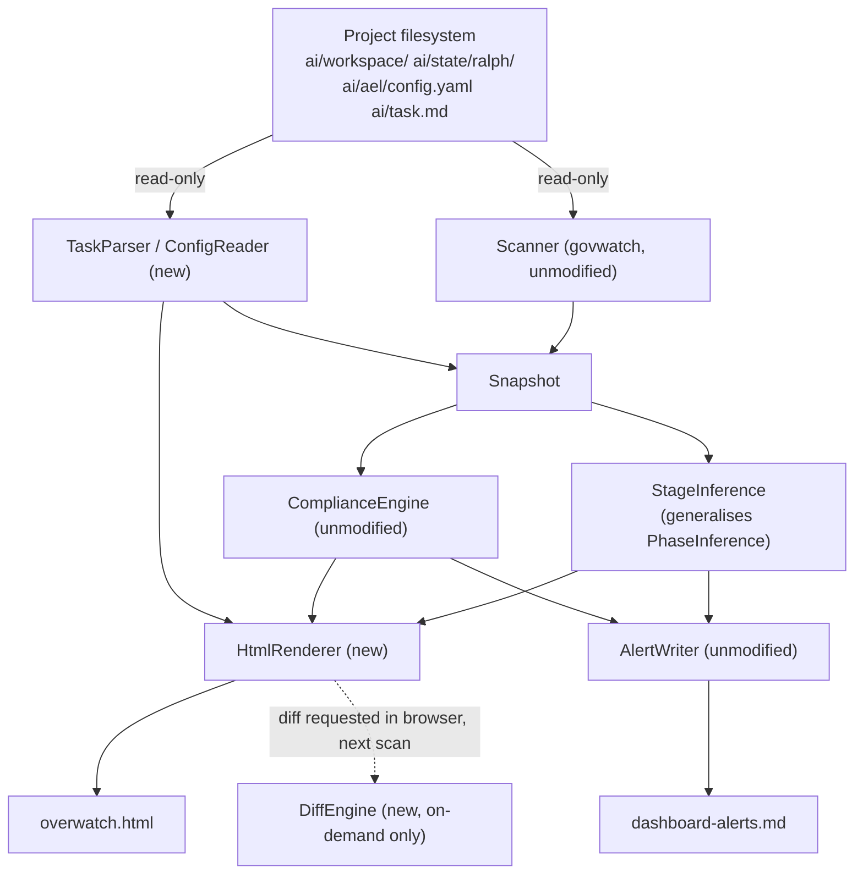

Created: 2026 August 21

# Project Overwatch Design

---

## Table of Contents

[1.0 Purpose](<#1.0 purpose>)
[2.0 Scope](<#2.0 scope>)
[3.0 Architecture](<#3.0 architecture>)
[3.1 Rendering Architecture — Resolution of OQ-01](<#3.1 rendering architecture — resolution of oq-01>)
[3.2 Component Diagram](<#3.2 component diagram>)
[3.3 Module Structure](<#3.3 module structure>)
[4.0 Data Model](<#4.0 data model>)
[5.0 Components](<#5.0 components>)
[6.0 Stage Inference Logic — Resolution of OQ-05](<#6.0 stage inference logic — resolution of oq-05>)
[7.0 Panel Specifications](<#7.0 panel specifications>)
[7.1 Monitoring Panel (FR-01)](<#7.1 monitoring panel (fr-01)>)
[7.2 Explain-This Overlay (FR-02)](<#7.2 explain-this overlay (fr-02)>)
[7.3 Decision-Tree Navigator (FR-03)](<#7.3 decision-tree navigator (fr-03)>)
[7.4 Config-as-Code Panel (FR-04)](<#7.4 config-as-code panel (fr-04)>)
[7.5 Requirements/Design Panel (FR-05) — Resolution of OQ-04](<#7.5 requirements/design panel (fr-05) — resolution of oq-04>)
[7.6 Stage-Gate Pipeline (FR-06)](<#7.6 stage-gate pipeline (fr-06)>)
[7.7 Task Board (FR-07) — Resolution of OQ-06](<#7.7 task board (fr-07) — resolution of oq-06>)
[7.8 Document Diff (FR-08) — Resolution of OQ-08](<#7.8 document diff (fr-08) — resolution of oq-08>)
[7.9 Guided Next-Step Advisor (FR-09) — Resolution of OQ-02](<#7.9 guided next-step advisor (fr-09) — resolution of oq-02>)
[7.10 First-Run Wizard (FR-10)](<#7.10 first-run wizard (fr-10)>)
[8.0 Interfaces](<#8.0 interfaces>)
[9.0 Document Parsing](<#9.0 document parsing>)
[10.0 Error Handling](<#10.0 error handling>)
[11.0 Non-Functional Compliance](<#11.0 non-functional compliance>)
[12.0 Element Registry](<#12.0 element registry>)
[13.0 Resolved Open Questions](<#13.0 resolved open questions>)
[14.0 Propagation and Coexistence with govwatch](<#14.0 propagation and coexistence with govwatch>)
[15.0 Requirements Traceability](<#15.0 requirements traceability>)
[Version History](<#version history>)

---

## 1.0 Purpose

This document specifies the component design for Project Overwatch, derived
from [requirements-project-overwatch.md](../requirements/requirements-project-overwatch.md)
v0.2. Project Overwatch is a read-only, browser-rendered project management
interface for a single project governed by the LLM-Governance-and-Orchestration
framework. It reuses `govwatch`'s data layer unmodified for its monitoring
function and adds nine further panels.

[Return to Table of Contents](<#table of contents>)

---

## 2.0 Scope

| Aspect | Decision |
|---|---|
| Deliverable | `ai/src/overwatch.py` (single module, coexists with `govwatch.py` until retirement — §14.0) |
| Dependency manifest | `ai/src/requirements-overwatch.txt` |
| Runtime location (downstream) | `ai/src/overwatch.py`, run from project root |
| Libraries | `pyyaml` only. No `textual`, no `rich`, no web framework — see §3.1 |
| Write target | `overwatch.html` (project root) and `dashboard-alerts.md` (unchanged from `govwatch`) only |
| Python | 3.11+ |

Out of scope items are inherited from requirements §7.0 and not restated here.

[Return to Table of Contents](<#table of contents>)

---

## 3.0 Architecture

### 3.1 Rendering Architecture — Resolution of OQ-01

**Decision: static HTML regeneration, no server process.** This is the single
highest-consequence design decision in this document and is called out
explicitly rather than left implicit in §5.0.

- Each scan cycle (same timer-driven cadence `govwatch` already uses) writes
  one self-contained file, `overwatch.html`, to the project root — inlined
  CSS and JS, with the scan `Snapshot` and all new panel data embedded as a
  single JSON blob in a `<script>` tag. No separate assets, no build step.
- The user opens this file once via `file://`. Auto-refresh is a
  `<meta http-equiv="refresh" content="{interval}">` tag — the browser
  re-reads the file from disk on the same interval `govwatch` already polls
  at. No socket, no port, no bound process beyond the existing scan loop.
- All interactivity specified in §7.0 (drill-down, task board, decision
  tree, diff view) is implemented as client-side JavaScript operating over
  the embedded JSON. Every panel's data is already produced once per scan;
  none of it requires a server round-trip to render or navigate.
- Rationale: this is the option that reintroduces the least of what the
  original `govwatch` design deliberately avoided (browser dependency is
  now accepted per this project's own decision; a persistent server process
  and localhost-binding complexity are not). It requires no new Python
  dependency — `json` and basic string templating from the standard library
  are sufficient — consistent with dependency discipline.
- Named trade-off: a full-page reload on each refresh loses scroll position
  and any expanded/collapsed UI state. Acceptable for a situational-awareness
  tool that is not used for live editing; not mitigated in this revision.

**NFR-01 clarification.** Requirements NFR-01 states the tool has no write
capability anywhere. That constraint governs *governance content* (anything
under `workspace/`, `task.md`, config files) and is unchanged — the tool
still writes nothing there. `overwatch.html` is the tool's own render
output, not governance content, and is its sole permitted write target,
directly analogous to `govwatch`'s existing `dashboard-alerts.md` carve-out.
This narrows NFR-01 as literally written; recorded here rather than left as
a silent inconsistency between the requirements and design documents.

### 3.2 Component Diagram



Legend: `DiffEngine` is invoked on the following scan after a diff is
requested in the browser (no server round-trip mid-session — see §7.8).
All filesystem access is read-only except the two named write targets.

### 3.3 Module Structure

Single file, internal separation by class — same convention `govwatch`
established.

```
ai/src/
├── overwatch.py                    # all classes + main()
└── requirements-overwatch.txt      # pyyaml
```

[Return to Table of Contents](<#table of contents>)

---

## 4.0 Data Model

Extends `govwatch`'s dataclasses (`ProjectPaths`, `DocumentRecord`,
`AelState`, `BudgetState`, `Alert`, `Snapshot` — reused unmodified, see
§12.0) with:

| Type | Fields |
|---|---|
| `TaskRow` | `task_id` (UUID or `—`), `item`, `status_text`, `references` (list of doc filenames/UUIDs), `bucket` (derived, §7.7) |
| `ConfigFile` | `path`, `raw_yaml`, `parse_ok` |
| `StageToken` | `uuid`, `stage` (§6.0), `documents` (list of `DocumentRecord`, open + closed) |
| `DiffResult` | `path`, `mode` (`git-history` \| `direct-compare`), `unified_diff`, `error` |

`Snapshot` gains three fields: `tasks: list[TaskRow]`, `configs:
list[ConfigFile]`, `stages: list[StageToken]`.

[Return to Table of Contents](<#table of contents>)

---

## 5.0 Components

| Component | Disposition |
|---|---|
| `Scanner`, `ComplianceEngine`, `AlertWriter` | Reused unmodified from `govwatch.py` |
| `PhaseInference` | Reused unmodified for the project-wide phase shown in §7.1; not replaced |
| `StageInference` | New. Wraps `PhaseInference`'s document-grouping logic per UUID rather than project-wide (§6.0) |
| `TaskParser` | New. Parses `ai/task.md`'s four-column table into `TaskRow` records (§9.0) |
| `ConfigReader` | New. Loads `ai/ael/config.yaml` and `ai/ael/recipes/*.yaml` via `yaml.safe_load`, read-only |
| `DiffEngine` | New. Produces `DiffResult` on demand, not during routine scans (§7.8) |
| `HtmlRenderer` | New. Replaces `GovwatchApp`. Serialises `Snapshot` to embedded JSON, renders the single HTML file, writes `overwatch.html` |
| `AdvisorEngine` | New. Detects governance-state gaps and produces plain-language next-step text (§7.9) |

`GovwatchApp` (the `textual.App` subclass) has no counterpart — it is
discarded, not ported (§3.1).

[Return to Table of Contents](<#table of contents>)

---

## 6.0 Stage Inference Logic — Resolution of OQ-05

Generalises `govwatch`'s project-wide `PhaseInference` precedence table
(design-govwatch.md §6.0) to per-UUID granularity. For each UUID group,
evaluated top-down, first match wins:

| Order | Condition (documents present for this UUID) | Stage |
|---|---|---|
| 1 | present in `closed/` for its most-advanced class | Shipped |
| 2 | test (T05) or result (T06) open | Test |
| 3 | prompt (T04) open | Prompt |
| 4 | change (T02) open | Change |
| 5 | issue (T03) open, no change | Issue |
| 6 | design (T01) open, no issue | Design |
| 7 | requirements (T07) open, no design | Requirements |

This table is authored for this design and has not been validated against
a large real-world document population beyond the examples reviewed during
requirements elicitation (GTach). Treat as a first cut, revisit once FR-06
has real usage.

[Return to Table of Contents](<#table of contents>)

---

## 7.0 Panel Specifications

### 7.1 Monitoring Panel (FR-01)

Ports the three existing `govwatch` panels (Workflow State, Compliance
Alerts, Document Registry) to HTML sections reading directly from
`Snapshot.phase`, `Snapshot.alerts`, `Snapshot.documents` — no new logic.
Colour-coding (VIOLATION red / WARNING yellow / OK green) carried forward
as CSS classes rather than `rich` markup.

### 7.2 Explain-This Overlay (FR-02)

A static lookup table, `EXPLANATIONS: dict[str, str]`, keyed by alert code
or panel-element id, embedded in `overwatch.py` and serialised into the
same JSON blob. Rendered client-side as a `<details>`/tooltip on the
relevant element. Each entry is authored to cite its `governance.md` clause
by section number.

### 7.3 Decision-Tree Navigator (FR-03)

A static nested-JSON tree (question → {answer → next node | terminal
guidance}), embedded and walked entirely client-side. First tree authored
covers §1.4.12 (trivial-change exemption) only; further branches are
additive, not a blocking dependency for FR-03's initial ship.

### 7.4 Config-as-Code Panel (FR-04)

`ConfigReader` output rendered as syntax-highlighted (client-side, no
Python dependency — a small vendored highlighter or plain `<pre>` with CSS,
TBD at implementation) read-only text blocks, one per file.

### 7.5 Requirements/Design Panel (FR-05) — Resolution of OQ-04

**Decision: full content, not a summary.** Framework documents are already
concise (numbered-section convention, per `obsidian_markdown_guidelines.md`
practice); an extraction/summarisation heuristic would add complexity and
risk of misrepresentation for no clear benefit at single-project scale.
Rendered as read-only text.

### 7.6 Stage-Gate Pipeline (FR-06)

One row per open UUID (from `Snapshot.stages`), stage token per §6.0
rendered as a horizontal position indicator (Requirements through Shipped).
Selecting a row expands the lifecycle thread inline — all documents for
that UUID, open and `closed/`, ordered by file modification time.

### 7.7 Task Board (FR-07) — Resolution of OQ-06

**Finding, not just a decision.** The GTach `ai/task.md` precedent reviewed
during requirements elicitation shows `Status` values that are free-text
and largely unique per row (e.g. *"Investigating — root cause confirmed,
fix not yet designed"*), not a small closed enum. A rigid multi-column
Kanban board does not fit this data shape.

**Resolution:** replace strict Kanban columns with a small set of coarse
buckets derived from keyword matching against `status_text`:

| Bucket | Match heuristic |
|---|---|
| Untriaged | `task_id == "—"` |
| Ready | contains "ready for", "authored" |
| In Progress | contains "investigating" |
| Deferred | contains "deferred" |
| Open | everything else |

The full `status_text` remains visible on each card regardless of bucket.
The keyword list is a first cut and will likely need tuning against more
task.md data over time — recorded as a known limitation, not a blocking
concern for initial delivery.

### 7.8 Document Diff (FR-08) — Resolution of OQ-08

Two-tier, mirroring `govwatch`'s own Tier 1/Tier 2 compliance pattern:

1. **Git history** (preferred): `git log --follow -p -- <path>`, invoked
   read-only via `subprocess`, parsed into per-commit unified diffs. Only
   invoked on demand — when a diff is requested in the browser — resolved
   on the *next* scan cycle and embedded then, not mid-session, consistent
   with the no-server architecture (§3.1).
2. **Direct comparison fallback**: if git is unavailable, or the requested
   pair is an open document and its `closed/` counterpart with no shared
   git history, Python's stdlib `difflib.unified_diff` compares the two
   files directly. No new dependency either way.

### 7.9 Guided Next-Step Advisor (FR-09) — Resolution of OQ-02

`AdvisorEngine` walks `Snapshot.documents` grouped by UUID and, for each
gap (open issue with no coupled change, open change with no coupled
prompt, etc.), produces one plain-language instruction line naming the
document class needed, the UUID to couple against, and the governing
clause. Output is appended to the same `dashboard-alerts.md` payload
`govwatch`'s `AlertWriter` already writes and the browser's copy-to-
clipboard action — **`dashboard-alerts.md` is retained, not replaced**;
its purpose widens from alerts-only to alerts-plus-next-steps. This
resolves OQ-02 (the file's fate) by extension rather than substitution.

### 7.10 First-Run Wizard (FR-10)

`HtmlRenderer` detects an empty `ai/workspace/` at scan time and, when
detected, has `AdvisorEngine` emit its bootstrap-specific guidance (e.g.
"no requirements document exists yet — ask the Strategic Domain to author
one") in place of the standard gap list. No separate code path.

[Return to Table of Contents](<#table of contents>)

---

## 8.0 Interfaces

### 8.1 Command Line

| Argument | Default | Purpose |
|---|---|---|
| `--project PATH` | cwd | project root override, unchanged from `govwatch` |
| `--interval N` | 5 | scan/refresh interval in seconds, unchanged from `govwatch` |

Invocation: `python ai/src/overwatch.py` from project root.

### 8.2 Browser Interaction

No key bindings (no TUI). All actions (drill-down, request diff, expand
task card) are click-driven, client-side JS against the embedded JSON.
Diff requests are queued and resolved on the following scan (§7.8).

### 8.3 overwatch.html Structure

Single file: inlined `<style>`, inlined `<script>`, one `<script
type="application/json" id="snapshot">` block carrying the full serialised
`Snapshot`. `<meta http-equiv="refresh" content="{interval}">` in `<head>`.

### 8.4 dashboard-alerts.md Format

Unchanged from `govwatch` (design-govwatch.md §8.3), with an added
"## Next Steps" section carrying `AdvisorEngine` output, `none` when empty.

[Return to Table of Contents](<#table of contents>)

---

## 9.0 Document Parsing

Filename and body-field parsing for T02/T03/T04 (issue/change/prompt)
carried forward unmodified from `govwatch` (design-govwatch.md §9.0). New
parsing for this design:

### 9.1 ai/task.md

Markdown table, four columns (`ID`, `Item`, `Status`, `References`),
per the format confirmed against the GTach project during requirements
elicitation. `ID` is either an 8-hex UUID or the literal `—`.

### 9.2 Config Files

`ai/ael/config.yaml` and `ai/ael/recipes/*.yaml` — `yaml.safe_load`,
rendered as-is. Parse failure produces a WARNING alert (NFR-04 pattern),
not an unhandled exception.

[Return to Table of Contents](<#table of contents>)

---

## 10.0 Error Handling

| Condition | Handling |
|---|---|
| Malformed/unparseable document | WARNING alert; scan continues — unchanged from `govwatch` |
| `ai/task.md` absent | Task Board panel renders empty state, not an error |
| Config file absent or malformed | Config-as-Code panel shows "unavailable"; WARNING alert |
| `overwatch.html` write failure | Logged to stderr; scan continues; next cycle retries |
| Git unavailable for diff (§7.8) | Falls back to direct comparison; if that also fails, `DiffResult.error` is shown in-panel |

[Return to Table of Contents](<#table of contents>)

---

## 11.0 Non-Functional Compliance

| NFR | Design provision |
|---|---|
| NFR-01 | Only `HtmlRenderer` and `AlertWriter` write, and only to `overwatch.html` / `dashboard-alerts.md` respectively — see §3.1 clarification |
| NFR-02 | Single-project scope; `ProjectPaths` unchanged from `govwatch` |
| NFR-03 | No read outside `ai/` plus `ai/task.md`, enforced by `ProjectPaths` resolution |
| NFR-04 | Per-document and per-config try/except → WARNING, unchanged pattern |
| NFR-05 | Absent `ai/state/ralph/` handled as idle, unchanged from `govwatch` |
| NFR-06 | Localhost/file-based only; no network exposure — no server exists to expose (§3.1) |
| NFR-07 | Dependency footprint: `pyyaml` only. Stated explicitly per requirements' deferral of this to design |

[Return to Table of Contents](<#table of contents>)

---

## 12.0 Element Registry

| Element | Type | Signature / note |
|---|---|---|
| `ProjectPaths`, `DocumentRecord`, `AelState`, `BudgetState`, `Alert`, `Snapshot` | class | reused from `govwatch`, `Snapshot` extended (§4.0) |
| `Scanner`, `PhaseInference`, `ComplianceEngine`, `AlertWriter` | class | reused unmodified |
| `TaskRow`, `ConfigFile`, `StageToken`, `DiffResult` | class | new (§4.0) |
| `TaskParser` | class | `parse(path: Path) -> list[TaskRow]` |
| `ConfigReader` | class | `read(paths: list[Path]) -> list[ConfigFile]` |
| `StageInference` | class | `infer(snapshot: Snapshot) -> list[StageToken]` |
| `DiffEngine` | class | `diff(path_a: Path, path_b: Path \| None) -> DiffResult` |
| `AdvisorEngine` | class | `advise(snapshot: Snapshot) -> list[str]` |
| `HtmlRenderer` | class | `render(snapshot: Snapshot) -> str`, `write(snapshot: Snapshot) -> None` |
| `main` | function | `main() -> None` |
| `EXPLANATIONS` | constant | alert-code/element-id → explanation text map (§7.2) |
| `DECISION_TREE` | constant | nested dict, §7.3 |

[Return to Table of Contents](<#table of contents>)

---

## 13.0 Resolved Open Questions

| OQ | Resolution |
|---|---|
| OQ-01 | Static HTML regeneration per scan cycle, `<meta>` refresh, no server process. §3.1. |
| OQ-02 | `dashboard-alerts.md` retained, extended with a Next Steps section carrying `AdvisorEngine` output. §7.9, §8.4. |
| OQ-03 | No new dependency beyond `pyyaml` (already required by `govwatch`). §2.0, NFR-07. |
| OQ-04 | Requirements/design panels render full document content, not a summary. §7.5. |
| OQ-05 | Per-UUID stage-inference precedence table. §6.0. |
| OQ-06 | Kanban columns replaced with keyword-derived coarse buckets; strict columns do not fit the observed `task.md` data shape. §7.7. |
| OQ-07 | Not resolved technically — accepted as a manual-maintenance risk. Explanatory content and decision-tree content are recommended to carry a "current as of governance.md vX.XX" stamp so staleness is at least visible, not silent. |
| OQ-08 | Two-tier: git history via `subprocess`, falling back to `difflib` direct comparison. Diffs resolved on the next scan cycle, not mid-session. §7.8. |
| OQ-09 | `govwatch.py` retirement requires: (a) FR-01 shipped in `overwatch.py`, (b) a manual side-by-side validation session against a real project confirming alert/state parity, (c) explicit sign-off. Not automatic on any document's approval. |
| OQ-10 | Not a design question — disposition of `requirements-govwatch.md` remains open, unactioned. |
| OQ-11 | Resolved in requirements v0.2 — tool named Project Overwatch. |

[Return to Table of Contents](<#table of contents>)

---

## 14.0 Propagation and Coexistence with govwatch

`ai/src/` propagates wholesale via `bin/propagate.sh`; no script change is
required for `overwatch.py` or `requirements-overwatch.txt` to propagate,
matching `govwatch`'s own precedent (design-govwatch.md §14.0/OQ-05).

During the period between `overwatch.py`'s FR-01 shipping and the
retirement criteria in OQ-09 being met, `govwatch.py` and `overwatch.py`
coexist in `ai/src/` and propagate together. This is a deliberate,
bounded interval, not an open-ended dual-maintenance commitment.

[Return to Table of Contents](<#table of contents>)

---

## 15.0 Requirements Traceability

| Requirement group | Design section |
|---|---|
| FR-01 Monitoring Panel | §7.1 |
| FR-02 Explain-This Overlay | §7.2 |
| FR-03 Decision-Tree Navigator | §7.3 |
| FR-04 Config-as-Code Panel | §7.4, §9.2 |
| FR-05 Requirements/Design Surfacing | §7.5 |
| FR-06 Stage-Gate Pipeline | §6.0, §7.6 |
| FR-07 Task Board | §7.7, §9.1 |
| FR-08 Document Diff | §7.8 |
| FR-09 Guided Next-Step Advisor | §7.9, §8.4 |
| FR-10 First-Run Wizard | §7.10 |
| NFR-01..07 | §11.0 |

[Return to Table of Contents](<#table of contents>)

---

## Version History

| Version | Date | Description |
|---|---|---|
| 0.1 | 2026-08-21 | Initial component design from requirements-project-overwatch.md v0.2. Resolves OQ-01 through OQ-09, OQ-11. OQ-07 and OQ-10 explicitly not resolved (recorded as accepted risk / remaining open). |

---

Copyright (c) 2026 William Watson. MIT License.
