Created: 2026 March 29

# Framework Workflow

---

## Table of Contents

[1.0 Execution Flowchart](<#1.0 execution flowchart>)
[Version History](<#version history>)

---

## 1.0 Execution Flowchart

```mermaid
flowchart TD
    Init[P01: Project Initialization] --> Budget_Init[Human: Run budget.py<br/>generates context-budget.md]
    Budget_Init --> Start([Human: Initiate Requirements])
    Start --> D1_Elicit[Strategic Domain: Requirements Elicitation P10]
    
    D1_Elicit --> H_Req{Human: Review Requirements}
    H_Req -->|Revise| D1_Elicit
    H_Req -->|Approve| D1_Baseline[Strategic Domain: Baseline Requirements]
    D1_Baseline --> D1_Design[Strategic Domain: Create master design T01]
    
    D1_Design --> H1{Human: Review<br/>master design}
    H1 -->|Revise| D1_Design
    H1 -->|Approve| D1_Decompose[Strategic Domain: Decompose to<br/>design elements T01]
    
    D1_Decompose --> H2{Human: Review<br/>design elements}
    H2 -->|Revise| D1_Decompose
    H2 -->|Approve| Trace1[Strategic Domain: Update<br/>traceability matrix P05]
    
    Trace1 --> D1_Tag[Human: Tag baseline<br/>in GitHub]
    
    D1_Tag --> Budget_Check{context-budget.md<br/>present?}
    Budget_Check -->|No| Budget_Remind[Strategic Domain: Instruct<br/>human to run budget.py]
    Budget_Remind --> Budget_Run[Human: Run budget.py]
    Budget_Run --> D1_Prompt
    Budget_Check -->|Yes| D1_Prompt[Strategic Domain: Create T04 prompt<br/>with design + schema]
    
    D1_Prompt --> H3{Human: Approve<br/>code generation}
    H3 -->|Revise| D1_Prompt
    H3 -->|Approve| D1_Instruct[Strategic Domain: Create<br/>ready-to-execute command]
    
    D1_Instruct --> H_Invoke[Human: Execute AEL command]
    H_Invoke --> AEL_Loop[AEL: Ralph Loop<br/>worker/reviewer cycle]
    AEL_Loop --> AEL_Result{SHIP or<br/>BLOCKED?}
    AEL_Result -->|BLOCKED| D1_Issue
    AEL_Result -->|SHIP| D1_Review[Strategic Domain: Review<br/>generated code]
    
    D1_Review --> Trace2[Strategic Domain: Update<br/>traceability matrix P05]
    Trace2 --> D1_Audit[Strategic Domain: Config audit<br/>code vs baseline]
    D1_Audit --> D1_Test_Doc[Strategic Domain: Create test doc T05]

    D1_Test_Doc --> D1_Generate_Tests[Strategic Domain: Generate pytest files from T05]
    D1_Generate_Tests --> H_Execute[Human: Execute tests]
    H_Execute --> D1_Review_Results[Strategic Domain: Review test results]
    D1_Review_Results --> Trace3[Strategic Domain: Update<br/>traceability matrix P05]
    Trace3 --> Test_Result{Tests pass?}
    
    Test_Result -->|Fail| D1_Issue[Strategic Domain: Create issue T03]
    D1_Issue --> Issue_Type{Issue type?}
    
    Issue_Type -->|Bug| D1_Change[Strategic Domain: Create change T02]
    D1_Change --> H4{Human: Review<br/>change}
    H4 -->|Revise| D1_Change
    H4 -->|Approve| Budget_Check2{context-budget.md<br/>present?}
    Budget_Check2 -->|No| Budget_Remind2[Strategic Domain: Instruct<br/>human to run budget.py]
    Budget_Remind2 --> Budget_Run2[Human: Run budget.py]
    Budget_Run2 --> D1_Debug_Prompt
    Budget_Check2 -->|Yes| D1_Debug_Prompt[Strategic Domain: Create debug<br/>prompt T04]
    
    D1_Debug_Prompt --> H5{Human: Approve<br/>debug}
    H5 -->|Revise| D1_Debug_Prompt
    H5 -->|Approve| D1_Debug_Instruct[Strategic Domain: Create<br/>ready-to-execute command]
    D1_Debug_Instruct --> H_Invoke
    
    Issue_Type -->|Design flaw| D1_Design_Change[Strategic Domain: Create change T02]
    D1_Design_Change --> H6{Human: Review<br/>change}
    H6 -->|Revise| D1_Design_Change
    H6 -->|Approve| D1_Update_Design[Strategic Domain: Update design]
    D1_Update_Design --> Trace4[Strategic Domain: Update<br/>traceability matrix P05]
    Trace4 --> D1_Prompt
    
    Test_Result -->|Pass| Progressive{Progressive<br/>validation<br/>complete?}
    
    Progressive -->|Targeted only| Integration_Val[Strategic Domain: Execute<br/>integration validation]
    Integration_Val --> Integration_Result{Integration<br/>tests pass?}
    Integration_Result -->|Fail| D1_Issue
    Integration_Result -->|Pass| Regression_Val
    
    Progressive -->|Integration done| Regression_Val[Strategic Domain: Execute<br/>full regression suite]
    Regression_Val --> Regression_Result{Regression<br/>tests pass?}
    Regression_Result -->|Fail| D1_Issue
    Regression_Result -->|Pass| H7
    
    Progressive -->|Full regression| H7{Human: Accept<br/>deliverable?}
    H7 -->|Reject| D1_Issue
    H7 -->|Accept| D1_Close[Strategic Domain: Close documents<br/>Move to closed/<br/>Git commit]
    D1_Close --> AEL_Reset[Human: Run --mode reset<br/>clear AEL state]
    AEL_Reset --> Complete([Complete])
```

[Return to Table of Contents](<#table of contents>)

---

## Version History

| Version | Date       | Description |
| ------- | ---------- | ----------- |
| 1.0     | 2026-03-29 | Extracted from governance.md §2.0 |

---

Copyright (c) 2025 William Watson. This work is licensed under the MIT License.
